# HelixQA Autonomous QA Session - Architecture Diagrams

## System Architecture Overview

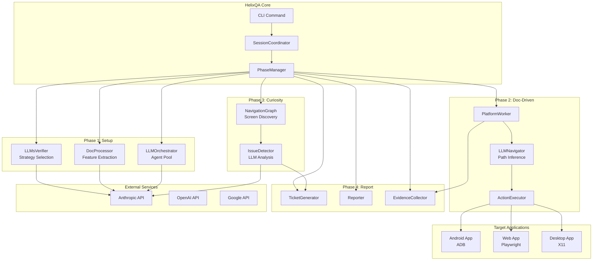

## Component Interaction Flow

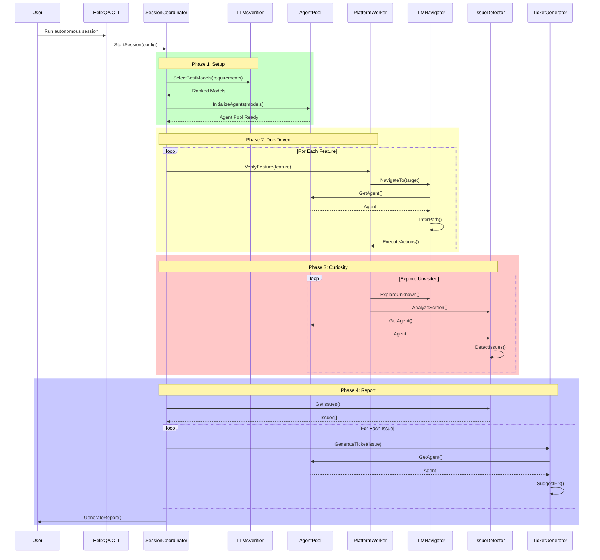

## Strategy Pattern Architecture

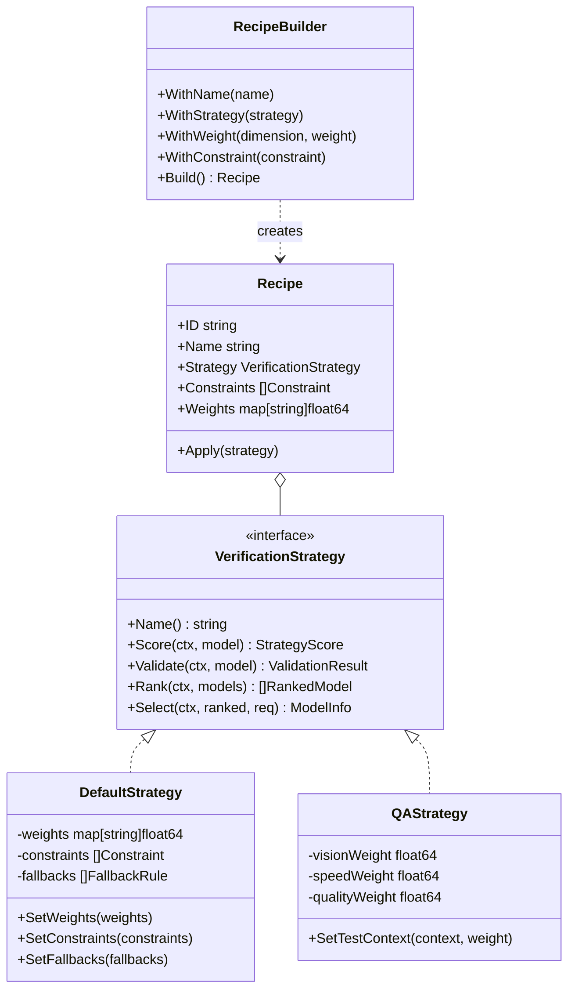

## Agent Pool Architecture

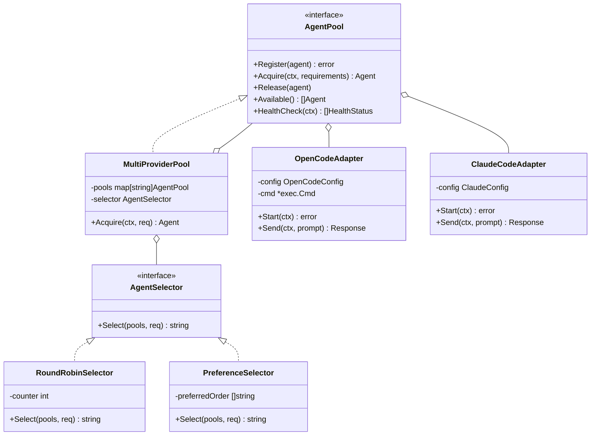

## Navigation Engine Flow

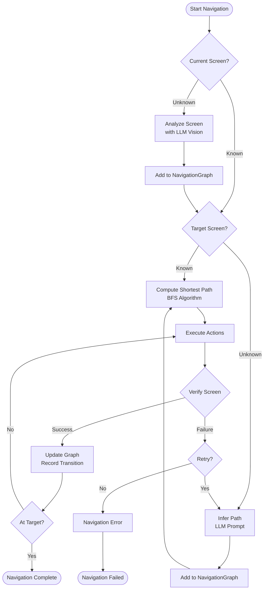

## Issue Detection Pipeline

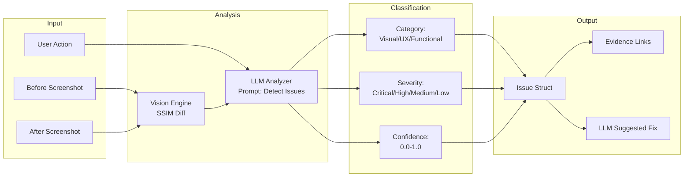

## Data Flow Architecture

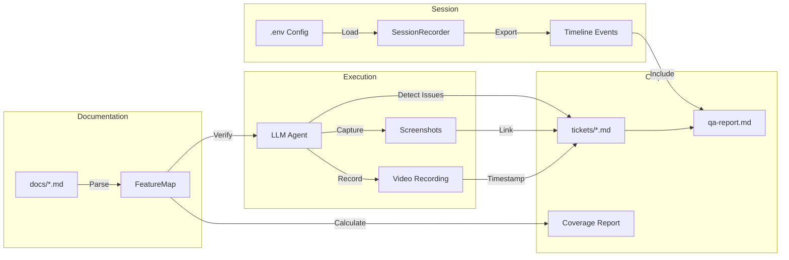

## Multi-Platform Support

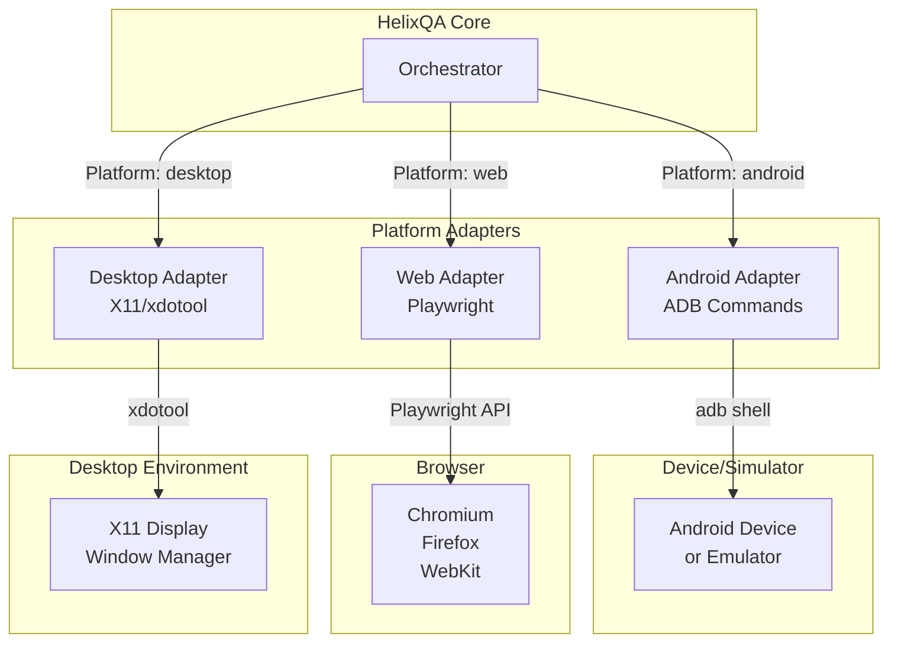

## State Management

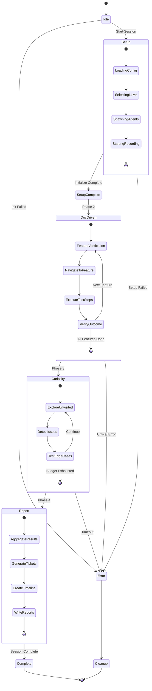

## API Gateway Pattern

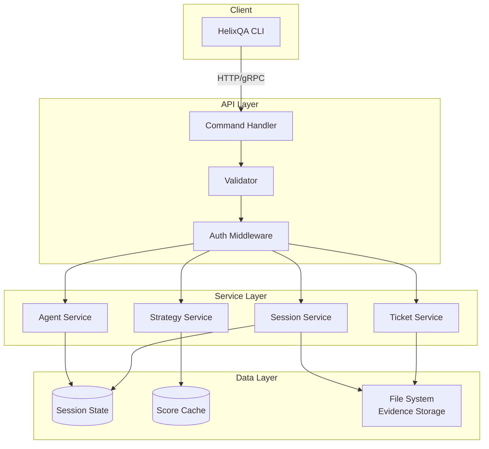

## Deployment Architecture

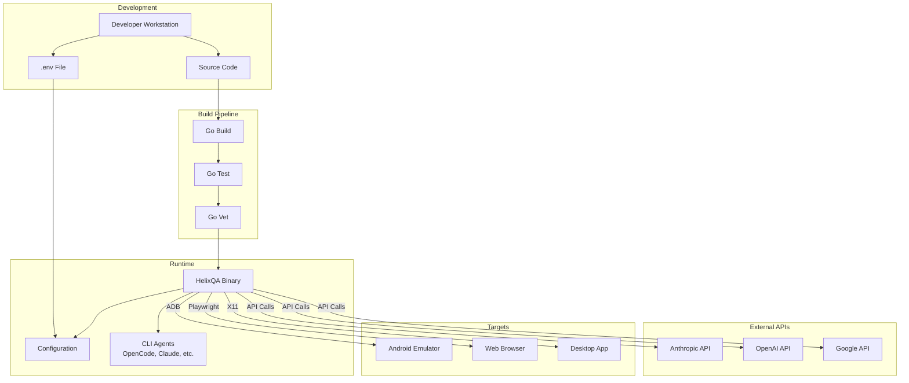

---

## Legend

- **Blue Boxes**: Core HelixQA Components
- **Green Boxes**: External Services/LLMs
- **Yellow Boxes**: Target Applications
- **Gray Boxes**: Infrastructure/Storage
- **Dashed Lines**: Optional/Conditional Flows
- **Solid Lines**: Primary Data Flow
