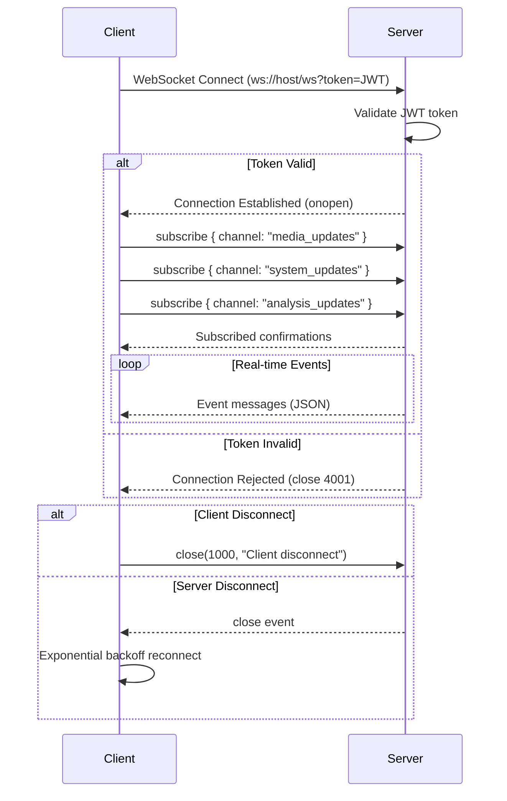
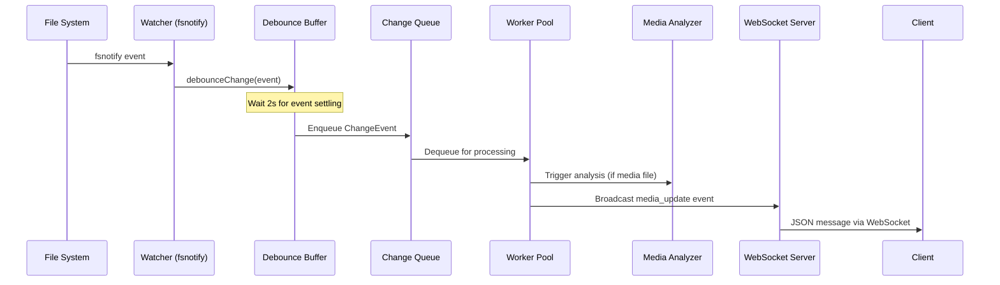

# Catalogizer WebSocket Events Documentation

This document describes all WebSocket event types, message formats, channels, and client/server interactions used in the Catalogizer real-time communication system.

## Connection

### Endpoint

```
ws://localhost:8080/ws?token=<JWT_TOKEN>
```

The WebSocket connection requires a valid JWT token passed as a query parameter. The token is the same JWT issued during authentication via `POST /api/v1/auth/login`.

### Connection Lifecycle



### Reconnection Strategy

The client implements exponential backoff reconnection:

| Attempt | Delay | Max Attempts |
|---------|-------|-------------|
| 1 | 1000ms | - |
| 2 | 2000ms | - |
| 3 | 4000ms | - |
| 4 | 8000ms | - |
| 5 | 16000ms | 5 (max) |

Reconnection is not attempted if the connection was closed intentionally (close code 1000).

Source: `catalog-web/src/lib/websocket.ts` -- `WebSocketClient.scheduleReconnect()`

## Message Format

All WebSocket messages use JSON encoding with the following envelope structure:

### Server-to-Client Message

```typescript
interface WebSocketMessage {
  type: string      // Event type identifier
  data: any         // Event-specific payload
  timestamp: string // ISO 8601 timestamp
}
```

### Client-to-Server Message

```typescript
// Subscribe to a channel
{
  "type": "subscribe",
  "channel": "media_updates"
}

// Unsubscribe from a channel
{
  "type": "unsubscribe",
  "channel": "system_updates"
}
```

## Channels

Clients subscribe to channels after connecting. The following channels are available:

| Channel | Description | Events Delivered |
|---------|-------------|-----------------|
| `media_updates` | Media catalog changes | `media_update` |
| `system_updates` | System health and status | `system_update` |
| `analysis_updates` | Media analysis progress and completion | `analysis_complete` |

## Event Types

### media_update

Fired when a media item is created, updated, deleted, or analyzed. Triggered by the real-time file watchers (`SMBChangeWatcher`, `EnhancedChangeWatcher`) when file system changes are detected across storage roots.

**Channel:** `media_updates`

**Payload:**

```typescript
interface MediaUpdate {
  action: 'created' | 'updated' | 'deleted' | 'analyzed'
  media_id: number          // ID of the affected media item
  media: {                  // Full or partial media object
    id: number
    title: string
    media_type: string      // video, audio, image, etc.
    year?: number
    description?: string
    cover_image?: string
    rating?: number
    quality?: string
    file_size?: number
    directory_path: string
    smb_path?: string
    created_at: string
    updated_at: string
  }
  analysis_id?: string      // Present when action is 'analyzed'
}
```

**Example Messages:**

```json
{
  "type": "media_update",
  "data": {
    "action": "created",
    "media_id": 42,
    "media": {
      "id": 42,
      "title": "The Matrix (1999)",
      "media_type": "video",
      "year": 1999,
      "quality": "1080p",
      "file_size": 4294967296,
      "directory_path": "/movies/The Matrix (1999)",
      "created_at": "2024-01-15T10:30:00Z",
      "updated_at": "2024-01-15T10:30:00Z"
    }
  },
  "timestamp": "2024-01-15T10:30:00Z"
}
```

```json
{
  "type": "media_update",
  "data": {
    "action": "deleted",
    "media_id": 42,
    "media": {
      "id": 42,
      "title": "The Matrix (1999)"
    }
  },
  "timestamp": "2024-01-15T11:00:00Z"
}
```

**Client-Side Behavior (React Query Cache):**

| Action | Cache Operations |
|--------|-----------------|
| `created` | Invalidate `media-search`, `media-stats`, `recent-media` queries |
| `updated` | Invalidate `media-search`, set `['media', media_id]` query data |
| `deleted` | Invalidate `media-search`, `media-stats`, remove `['media', media_id]` |
| `analyzed` | Invalidate `['media', media_id]` query |

Source: `catalog-web/src/lib/websocket.ts` -- `handleMediaUpdate()`

### system_update

Fired when a system component reports a health status change. Used for real-time monitoring of storage connectivity, service health, and system-wide alerts.

**Channel:** `system_updates`

**Payload:**

```typescript
interface SystemUpdate {
  action: 'health_check' | 'storage_update' | 'service_status'
  component: string                             // Component name
  status: 'healthy' | 'warning' | 'error'      // Health status
  message?: string                               // Human-readable message
  details?: any                                   // Component-specific details
}
```

**Example Messages:**

```json
{
  "type": "system_update",
  "data": {
    "action": "health_check",
    "component": "smb_storage",
    "status": "healthy",
    "message": "All SMB connections active",
    "details": {
      "connected_shares": 3,
      "total_shares": 3
    }
  },
  "timestamp": "2024-01-15T10:00:00Z"
}
```

```json
{
  "type": "system_update",
  "data": {
    "action": "storage_update",
    "component": "nas-backup",
    "status": "error",
    "message": "SMB connection lost to nas-backup",
    "details": {
      "host": "192.168.1.100",
      "share": "backup",
      "last_connected": "2024-01-15T09:55:00Z",
      "retry_count": 3
    }
  },
  "timestamp": "2024-01-15T10:05:00Z"
}
```

```json
{
  "type": "system_update",
  "data": {
    "action": "service_status",
    "component": "media_analysis",
    "status": "warning",
    "message": "Analysis queue backlog detected",
    "details": {
      "queue_length": 500,
      "workers": 4,
      "estimated_completion": "2024-01-15T12:00:00Z"
    }
  },
  "timestamp": "2024-01-15T10:10:00Z"
}
```

**Client-Side Behavior:**

| Status | UI Action |
|--------|-----------|
| `healthy` | Console log only (no toast) |
| `warning` | Warning toast displayed for 6 seconds |
| `error` | Error toast displayed |

Source: `catalog-web/src/lib/websocket.ts` -- `handleSystemUpdate()`

### analysis_complete

Fired when a batch media analysis operation completes. This typically follows a storage scan or when the analysis pipeline finishes processing a set of new or changed files.

**Channel:** `analysis_updates`

**Payload:**

```typescript
interface AnalysisComplete {
  items_processed: number    // Number of items analyzed
  items_identified: number   // Items successfully matched to known media
  items_failed: number       // Items that failed analysis
  duration_ms: number        // Total analysis duration
  storage_root?: string      // Storage root that was scanned
  scan_id?: number           // Associated scan history ID
}
```

**Example Message:**

```json
{
  "type": "analysis_complete",
  "data": {
    "items_processed": 150,
    "items_identified": 142,
    "items_failed": 8,
    "duration_ms": 45000,
    "storage_root": "nas-media",
    "scan_id": 23
  },
  "timestamp": "2024-01-15T10:45:00Z"
}
```

**Client-Side Behavior:**

- Success toast: "Analysis complete for {items_processed} items"
- Invalidates `media-search` and `media-stats` React Query caches

Source: `catalog-web/src/lib/websocket.ts` -- `handleAnalysisComplete()`

### notification

General-purpose notification events for user-facing messages that do not fit into the other categories.

**Channel:** Delivered to all connected clients (no specific channel subscription required).

**Payload:**

```typescript
interface Notification {
  type: string        // Notification category
  title: string       // Notification title
  message: string     // Display message
  level: 'info' | 'success' | 'warning' | 'error'  // Severity level
}
```

**Example Message:**

```json
{
  "type": "notification",
  "data": {
    "type": "conversion",
    "title": "Conversion Complete",
    "message": "video.mp4 has been converted to mp3",
    "level": "success"
  },
  "timestamp": "2024-01-15T11:00:00Z"
}
```

**Client-Side Behavior:**

| Level | UI Action |
|-------|-----------|
| `info` | Info toast with info icon |
| `success` | Success toast (green) |
| `warning` | Warning toast with warning icon |
| `error` | Error toast (red) |

Source: `catalog-web/src/lib/websocket.ts` -- `handleNotification()`

## Server-Side Event Sources

### File System Change Events

The real-time file monitoring system generates events through two watcher implementations:

#### SMBChangeWatcher (`catalog-api/internal/media/realtime/watcher.go`)

Basic file system change monitoring using `fsnotify`. Detects:

| Operation | fsnotify Event | Description |
|-----------|---------------|-------------|
| `created` | `fsnotify.Create` | New file or directory created |
| `modified` | `fsnotify.Write` | File content changed |
| `deleted` | `fsnotify.Remove` | File or directory removed |
| `moved` | `fsnotify.Rename` | File or directory renamed |

Configuration:
- Worker count: 2
- Change queue buffer: 10,000 events
- Debounce delay: 2 seconds

#### EnhancedChangeWatcher (`catalog-api/internal/media/realtime/enhanced_watcher.go`)

Advanced watcher with rename detection via file hash comparison. Extends the basic watcher with:

- Recursive directory watching
- MD5 hash computation for files under 100MB
- Integration with `RenameTracker` service for detecting move operations (delete + create pairs)
- Automatic database metadata updates for modified files
- Media file detection for triggering re-analysis

Configuration:
- Worker count: 4
- Change queue buffer: 10,000 events
- Debounce delay: 2 seconds

#### Change Event Flow



### Change Log Table

All file system change events are persisted to the `change_log` table for replay and audit purposes. Unprocessed events can be replayed via `ProcessPendingChanges()`.

## Client Integration (React)

### useWebSocket Hook

The `useWebSocket` React hook (`catalog-web/src/lib/websocket.ts`) provides a complete WebSocket integration:

```typescript
const {
  connect,           // Establish WebSocket connection
  disconnect,        // Close connection gracefully
  send,              // Send arbitrary message to server
  subscribe,         // Subscribe to a channel
  unsubscribe,       // Unsubscribe from a channel
  getConnectionState // Get current state: 'connecting' | 'open' | 'closing' | 'closed'
} = useWebSocket()
```

### Auto-subscribed Channels

On successful connection, the client automatically subscribes to:
1. `media_updates` -- media catalog changes
2. `system_updates` -- system health events
3. `analysis_updates` -- analysis pipeline events

### React Query Integration

WebSocket events automatically invalidate or update React Query caches, ensuring the UI stays synchronized without manual polling. The query keys affected are:

| Query Key | Invalidated By |
|-----------|---------------|
| `['media-search']` | media created, updated, deleted, analysis_complete |
| `['media-stats']` | media created, deleted, analysis_complete |
| `['recent-media']` | media created |
| `['media', id]` | media updated (direct set), media analyzed (invalidate) |

### Message Queue

The `WebSocketClient` maintains an internal message queue. Messages sent while disconnected are buffered and automatically delivered when the connection is re-established:

```typescript
// Messages are queued if not connected
wsClient.send({ type: 'subscribe', channel: 'media_updates' })
// When connection opens, queued messages are flushed automatically
```
