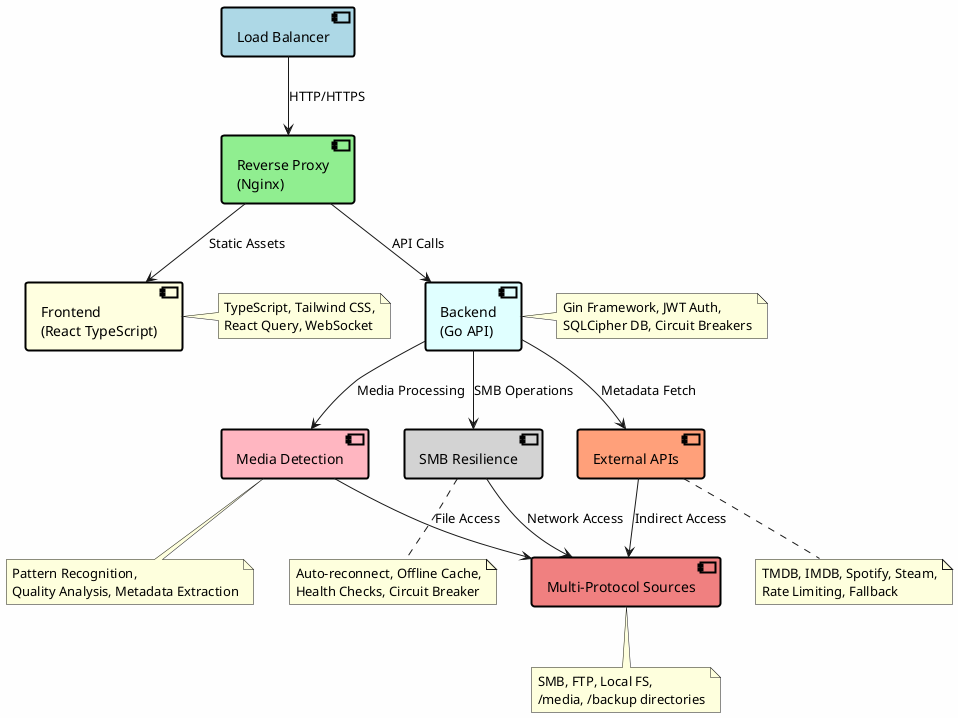
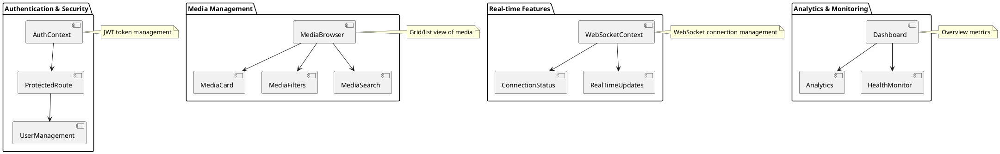
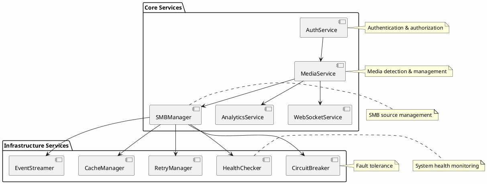
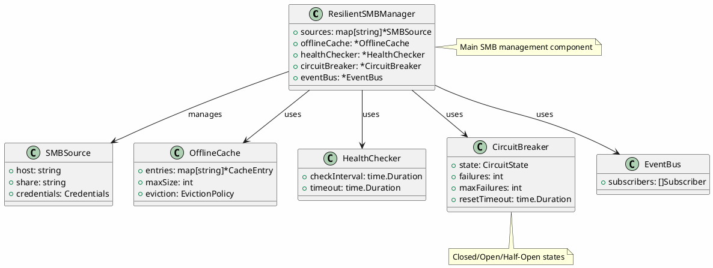
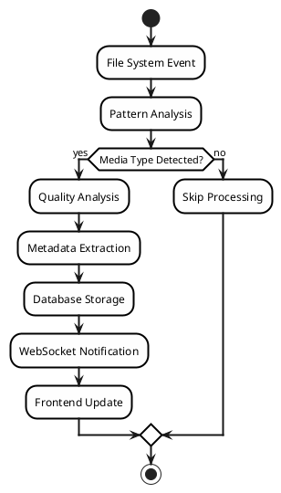
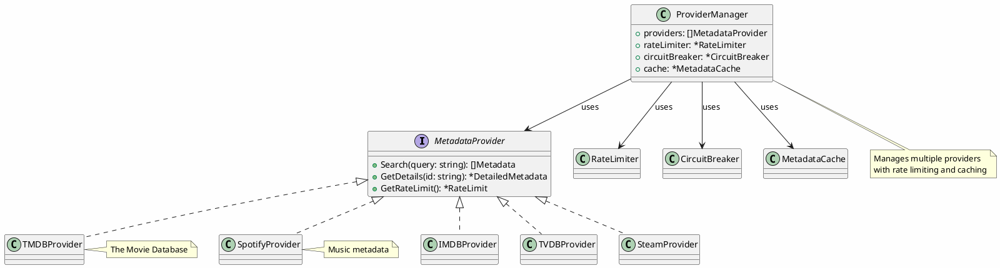

# Catalogizer Architecture Documentation

## Overview

Catalogizer is built using a modern microservices-inspired architecture with clear separation of concerns, robust error handling, and high availability in mind. The system is designed to handle media collection management at scale while maintaining resilience against various failure modes.

## System Architecture

### Mermaid System Architecture Diagram

```mermaid
graph TB
    subgraph Clients["Client Applications"]
        CW["catalog-web<br/>(React/TypeScript)"]
        CD["catalogizer-desktop<br/>(Tauri/Rust + React)"]
        IW["installer-wizard<br/>(Tauri/Rust + React)"]
        CA["catalogizer-android<br/>(Kotlin/Compose)"]
        CTV["catalogizer-androidtv<br/>(Kotlin/Compose)"]
        ACL["catalogizer-api-client<br/>(TypeScript Library)"]
    end

    subgraph Infrastructure["Infrastructure"]
        LB["Load Balancer"]
        RP["Reverse Proxy (Nginx)"]
    end

    subgraph Backend["catalog-api (Go/Gin)"]
        API["REST API /api/v1/*"]
        WS["WebSocket Server /ws/*"]
        AUTH["Auth Service (JWT + Sessions)"]
        MW["Middleware Stack<br/>CORS, Rate Limit,<br/>Input Validation, Metrics"]
    end

    subgraph CoreServices["Core Services"]
        CAT["Catalog Service"]
        SMB_SVC["SMB Service"]
        SMB_DISC["SMB Discovery"]
        MEDIA_REC["Media Recognition"]
        DUP["Duplicate Detection"]
        REC["Recommendation Service"]
        SUB["Subtitle Service"]
        CONV["Conversion Service"]
        ANALYTICS["Analytics Service"]
        CONFIG["Configuration Service"]
        ERR_SVC["Error/Crash Reporting"]
        LOG_SVC["Log Management"]
        FAV["Favorites Service"]
    end

    subgraph DataLayer["Data Layer"]
        SQLITE["SQLite/SQLCipher<br/>(Encrypted DB)"]
        REDIS["Redis<br/>(Rate Limiting / Cache)"]
    end

    subgraph FileWatch["Real-time File Monitoring"]
        WATCHER["SMBChangeWatcher"]
        ENH["EnhancedChangeWatcher<br/>(rename detection)"]
        QUEUE["Change Event Queue"]
    end

    subgraph Providers["External Metadata Providers"]
        TMDB["TMDB"]
        IMDB["IMDB"]
        TVDB["TVDB"]
        SPOTIFY["Spotify"]
        STEAM["Steam"]
    end

    subgraph Storage["Multi-Protocol Storage"]
        LOCAL["Local FS"]
        SMB_P["SMB/CIFS"]
        FTP["FTP"]
        NFS["NFS"]
        WEBDAV["WebDAV"]
    end

    CW & CD & CA & CTV & ACL & IW -->|HTTP/WS| LB
    LB --> RP
    RP --> API & WS

    API --> MW --> AUTH
    API --> CAT & SMB_SVC & SMB_DISC
    API --> MEDIA_REC & REC & SUB & CONV
    API --> ANALYTICS & CONFIG & ERR_SVC & LOG_SVC & FAV

    CAT & AUTH & CONV & ANALYTICS --> SQLITE
    AUTH --> REDIS
    MEDIA_REC --> TMDB & IMDB & TVDB & SPOTIFY & STEAM
    WATCHER & ENH --> QUEUE
    QUEUE --> MEDIA_REC
    WS --> QUEUE
    CAT --> LOCAL & SMB_P & FTP & NFS & WEBDAV

    style Backend fill:#e1f5fe
    style DataLayer fill:#fff3e0
    style Providers fill:#f3e5f5
    style Storage fill:#e8f5e9
    style Clients fill:#fce4ec
    style FileWatch fill:#fff9c4
```



### High-Level Architecture

```
┌─────────────────────────────────────────────────────────────────┐
│                        Load Balancer                           │
└─────────────────┬───────────────────────────────────────────────┘
                  │
┌─────────────────▼───────────────────────────────────────────────┐
│                   Reverse Proxy (Nginx)                        │
└─────────────┬─────────────────────────────────┬─────────────────┘
              │                                 │
┌─────────────▼─────────────┐         ┌────────▼─────────────┐
│      Frontend (React)     │         │   Backend (Go API)   │
│                           │         │                      │
│  • TypeScript             │         │  • Gin Framework     │
│  • Tailwind CSS           │         │  • JWT Auth          │
│  • React Query            │         │  • SQLCipher DB      │
│  • WebSocket Client       │         │  • Circuit Breakers  │
│  • Real-time Updates      │         │  • Retry Logic       │
└───────────────────────────┘         └──────┬───────────────┘
                                             │
         ┌────────────────────────────────────┼────────────────┐
         │                                    │                │
┌───────▼────────┐  ┌─────────▼──────────┐  ┌▼──────────────┐
│ Media Detection│  │   SMB Resilience   │  │ External APIs │
│                │  │                    │  │               │
│ • Pattern      │  │ • Auto-reconnect   │  │ • TMDB        │
│   Recognition  │  │ • Offline Cache    │  │ • IMDB        │
│ • Quality      │  │ • Health Checks    │  │ • Spotify     │
│   Analysis     │  │ • Circuit Breaker  │  │ • Steam       │
│ • Metadata     │  │ • Retry Logic      │  │ • Rate Limit  │
│   Extraction   │  │ • Event Streaming  │  │ • Fallback    │
└────────────────┘  └────────────────────┘  └───────────────┘
         │                     │                      │
         └─────────────────────┼──────────────────────┘
                               │
          ┌─────────────────────▼─────────────────────┐
          │         Multi-Protocol Sources           │
          │                                           │
          │  ┌─────────────┐  ┌─────────────┐        │
          │  │   Server 1  │  │   Server 2  │  ...   │
          │  │   /media    │  │   /backup   │        │
          │  └─────────────┘  └─────────────┘        │
          └───────────────────────────────────────────┘
```

#### System Architecture Diagram (Drawio/PlantUML)

The following PlantUML diagram provides a visual representation of the high-level system architecture. This diagram can be imported into Drawio for editing.



### Component Details

#### 1. Frontend Layer (React TypeScript)

**Technology Stack:**
- React 18 with TypeScript
- Vite for build tooling
- Tailwind CSS for styling
- React Query for state management
- Framer Motion for animations
- WebSocket for real-time updates

**Key Components:**
```typescript
// Authentication & Security
AuthContext              // JWT token management
ProtectedRoute          // Route-level authorization
UserManagement          // Admin user controls

// Media Management
MediaBrowser            // Grid/list view of media
MediaCard              // Individual media display
MediaFilters           // Advanced filtering
MediaSearch            // Search functionality

// Real-time Features
WebSocketContext       // WebSocket connection management
ConnectionStatus       // Connection health indicator
RealTimeUpdates        // Live data synchronization

// Analytics & Monitoring
Dashboard              // Overview metrics
Analytics              // Detailed statistics
HealthMonitor          // System health display
```

**State Management:**
```typescript
// React Query Cache Structure
{
  'media-search': MediaSearchResponse,
  'media-stats': MediaStatistics,
  'auth-status': AuthenticationStatus,
  'smb-status': SMBSourceStatus,
  'health-check': SystemHealth
}
```

**Frontend Component Diagram (Drawio/PlantUML)**



#### 2. Backend Layer (Go API)

**Technology Stack:**
- Go 1.21+ with Gin framework
- SQLCipher for encrypted database
- JWT for authentication
- WebSocket for real-time communication
- Circuit breakers for fault tolerance
- Structured logging with Zap

**Service Architecture:**
```go
// Core Services
AuthService             // Authentication & authorization
MediaService           // Media detection & management
SMBManager             // SMB source management
AnalyticsService       // Statistics & reporting
WebSocketService       // Real-time communication

// Infrastructure Services
CircuitBreaker         // Fault tolerance
RetryManager           // Automatic retry logic
HealthChecker          // System health monitoring
CacheManager           // Offline caching
EventStreamer          // Event publishing
```

**Database Schema:**
```sql
-- Core Tables
users                  -- User accounts & permissions
media_items            -- Media metadata & file info
external_metadata      -- Third-party API data
media_versions         -- Multiple quality versions
smb_sources           -- SMB connection configurations

-- Monitoring Tables
health_checks         -- System health history
error_logs           -- Error tracking & analysis
performance_metrics  -- System performance data
audit_logs          -- User activity tracking
```

**Backend Service Diagram (Drawio/PlantUML)**



#### 3. SMB Resilience Layer

The SMB resilience layer is a critical component that ensures the system remains functional even when SMB sources are temporarily unavailable.

**Key Features:**
- **Automatic Reconnection**: Exponential backoff retry strategy
- **Offline Caching**: Local cache for metadata when sources are down
- **Health Monitoring**: Continuous health checks with alerting
- **Circuit Breakers**: Prevent cascade failures
- **Event-Driven Architecture**: Real-time status updates

```go
// SMB Resilience Components
type ResilientSMBManager struct {
    sources      map[string]*SMBSource
    offlineCache *OfflineCache
    healthChecker *HealthChecker
    circuitBreaker *CircuitBreaker
    eventBus     *EventBus
}

// Connection States
StateClosed       // Normal operation
StateHalfOpen     // Testing after failure
StateOpen         // Circuit breaker activated
StateOffline      // Extended failure mode
```

**SMB Resilience Diagram (Drawio/PlantUML)**



#### 4. Media Detection Engine

**Detection Pipeline:**
```
File System Event → Pattern Analysis → Media Type Detection → Quality Analysis → Metadata Extraction → Database Storage
```

**Pattern Recognition:**
```go
// Movie Detection Patterns
moviePatterns := []Pattern{
    {Regex: `^(.+?)\s*[\(\[]?(\d{4})[\)\]]?.*\.(mkv|mp4|avi)$`, Weight: 0.9},
    {Regex: `^(.+?)\s*-\s*(\d{4}).*\.(mkv|mp4|avi)$`, Weight: 0.8},
}

// TV Show Patterns
tvPatterns := []Pattern{
    {Regex: `^(.+?)\s*[Ss](\d{1,2})[Ee](\d{1,2}).*$`, Weight: 0.95},
    {Regex: `^(.+?)\s*(\d{1,2})x(\d{1,2}).*$`, Weight: 0.85},
}
```

**Quality Analysis:**
```go
type QualityMetrics struct {
    Resolution    string  // 720p, 1080p, 4K, etc.
    Codec         string  // H.264, H.265, AV1
    Bitrate       int     // Video bitrate
    AudioCodec    string  // AAC, DTS, Dolby
    FileSize      int64   // File size in bytes
    OverallScore  float64 // Calculated quality score
}
```

**Media Detection Pipeline Diagram (Drawio/PlantUML)**



#### 5. External API Integration

**Provider Architecture:**
```go
type MetadataProvider interface {
    Search(query string) ([]Metadata, error)
    GetDetails(id string) (*DetailedMetadata, error)
    GetRateLimit() *RateLimit
}

// Implemented Providers
TMDBProvider     // The Movie Database
IMDBProvider     // Internet Movie Database
TVDBProvider     // TheTVDB
SpotifyProvider  // Music metadata
SteamProvider    // Game information
```

**Rate Limiting & Fallback:**
```go
type ProviderManager struct {
    providers    []MetadataProvider
    rateLimiter  *RateLimiter
    circuitBreaker *CircuitBreaker
    cache        *MetadataCache
}
```

**External API Integration Diagram (Drawio/PlantUML)**



## Data Flow

### 1. Media Discovery Flow

```
SMB Source Change → File System Watcher → Event Queue → Media Detector →
Pattern Analysis → External API Lookup → Quality Analysis → Database Storage →
WebSocket Notification → Frontend Update
```

### 2. User Authentication Flow

```
Login Request → JWT Validation → Permission Check → Database Query →
Token Generation → Client Storage → Authenticated Session
```

### 3. Real-time Update Flow

```
System Event → Event Bus → WebSocket Server → Connected Clients →
React Query Cache Invalidation → UI Update
```

### 4. SMB Failure Recovery Flow

```
SMB Connection Lost → Circuit Breaker Opens → Offline Mode Activated →
Background Reconnection Attempts → Connection Restored →
Cache Synchronization → Normal Operation Resumed
```

## Resilience Patterns

### 1. Circuit Breaker Pattern

```go
type CircuitBreaker struct {
    state        CircuitState  // Closed, Open, Half-Open
    failures     int
    maxFailures  int
    resetTimeout time.Duration
}

// Usage in SMB operations
func (s *SMBService) ListDirectory(path string) error {
    return s.circuitBreaker.Execute(func() error {
        return s.actualListDirectory(path)
    })
}
```

### 2. Retry Pattern with Exponential Backoff

```go
type RetryConfig struct {
    MaxAttempts   int
    InitialDelay  time.Duration
    BackoffFactor float64
    Jitter        bool
}

// Automatic retry for transient failures
func (s *SMBService) ConnectWithRetry(source *SMBSource) error {
    return Retry(context.Background(), s.retryConfig, func() error {
        return s.connect(source)
    })
}
```

### 3. Bulkhead Pattern

```go
type Bulkhead struct {
    semaphore chan struct{}  // Limit concurrent operations
    timeout   time.Duration
}

// Isolate different resource pools
smbBulkhead := NewBulkhead(BulkheadConfig{
    MaxConcurrent: 10,
    Timeout:      30 * time.Second,
})
```

### 4. Cache-Aside Pattern

```go
type OfflineCache struct {
    entries   map[string]*CacheEntry
    maxSize   int
    eviction  EvictionPolicy
}

// Cache metadata when sources are unavailable
func (c *OfflineCache) GetOrFetch(key string, fetcher func() interface{}) interface{} {
    if value, exists := c.Get(key); exists {
        return value
    }

    value := fetcher()
    c.Set(key, value)
    return value
}
```

## Security Architecture

### 1. Authentication & Authorization

```go
// JWT Claims Structure
type Claims struct {
    UserID      int64    `json:"user_id"`
    Username    string   `json:"username"`
    Role        string   `json:"role"`
    Permissions []string `json:"permissions"`
    jwt.RegisteredClaims
}

// Permission-based Access Control
func RequirePermission(permission string) gin.HandlerFunc {
    return func(c *gin.Context) {
        user := GetCurrentUser(c)
        if !user.HasPermission(permission) {
            c.JSON(403, gin.H{"error": "Insufficient permissions"})
            c.Abort()
            return
        }
        c.Next()
    }
}
```

### 2. Database Security

```sql
-- SQLCipher Configuration
PRAGMA cipher_page_size = 4096;
PRAGMA kdf_iter = 64000;
PRAGMA cipher_hmac_algorithm = HMAC_SHA512;
PRAGMA cipher_kdf_algorithm = PBKDF2_HMAC_SHA512;
```

### 3. Input Validation & Sanitization

```go
// Request validation with binding tags
type MediaSearchRequest struct {
    Query    string `json:"query" binding:"max=255"`
    Type     string `json:"type" binding:"oneof=movie tv_show music game"`
    Year     int    `json:"year" binding:"min=1900,max=2030"`
    Rating   float64 `json:"rating" binding:"min=0,max=10"`
}
```

## Performance Optimizations

### 1. Database Indexing Strategy

```sql
-- High-performance indexes
CREATE INDEX idx_media_type_year ON media_items(media_type, year);
CREATE INDEX idx_media_rating_desc ON media_items(rating DESC);
CREATE INDEX idx_media_updated_desc ON media_items(updated_at DESC);

-- Full-text search index
CREATE VIRTUAL TABLE media_search USING fts5(
    title, description,
    content='media_items',
    content_rowid='id'
);
```

### 2. Caching Strategy

```go
// Multi-level caching
type CacheManager struct {
    l1Cache    *sync.Map         // In-memory cache
    l2Cache    *redis.Client     // Redis cache (if available)
    dbCache    *sql.DB           // Database cache
}

// Cache hierarchy
Memory Cache (L1) → Redis Cache (L2) → Database → External APIs
```

### 3. Connection Pooling

```go
// Database connection pool
db.SetMaxOpenConns(25)
db.SetMaxIdleConns(5)
db.SetConnMaxLifetime(5 * time.Minute)

// HTTP client pool for external APIs
client := &http.Client{
    Transport: &http.Transport{
        MaxIdleConns:        100,
        MaxIdleConnsPerHost: 10,
        IdleConnTimeout:     90 * time.Second,
    },
    Timeout: 30 * time.Second,
}
```

## Monitoring & Observability

### 1. Health Checks

```go
// Comprehensive health monitoring
healthChecker.AddCheck(HealthCheck{
    Name:     "database",
    Check:    func(ctx context.Context) error { return db.PingContext(ctx) },
    Critical: true,
})

healthChecker.AddCheck(HealthCheck{
    Name:     "smb_sources",
    Check:    checkSMBSources,
    Critical: false,
})
```

### 2. Metrics Collection

```go
// Performance metrics
type Metrics struct {
    RequestDuration   histogram
    RequestCount      counter
    ActiveConnections gauge
    ErrorRate         counter
}
```

### 3. Structured Logging

```go
// Contextual logging with Zap
logger.Info("Media item processed",
    zap.String("title", media.Title),
    zap.String("type", media.Type),
    zap.Duration("processing_time", duration),
    zap.Int64("file_size", media.FileSize))
```

## Scalability Considerations

### 1. Horizontal Scaling

- **Stateless Design**: All services are stateless for easy scaling
- **Load Balancing**: Round-robin distribution of requests
- **Database Replication**: Read replicas for query scaling
- **Microservice Architecture**: Independent service scaling

### 2. Vertical Scaling

- **Resource Optimization**: Efficient memory and CPU usage
- **Connection Pooling**: Optimal database connection management
- **Caching**: Reduced database load through intelligent caching
- **Async Processing**: Non-blocking operations where possible

### 3. Data Partitioning

```sql
-- Partition large tables by date
CREATE TABLE media_items_2024 PARTITION OF media_items
FOR VALUES FROM ('2024-01-01') TO ('2025-01-01');

-- Index partitioning for better query performance
CREATE INDEX idx_media_2024_type ON media_items_2024(media_type);
```

This architecture provides a robust, scalable, and resilient foundation for the Catalogizer system, with comprehensive error handling and recovery mechanisms to ensure high availability even in the face of various failure scenarios.

## Related Documentation

- [Database Schema](DATABASE_SCHEMA.md) - Complete database table and index reference
- [SQL Migrations](SQL_MIGRATIONS.md) - Migration versions, schema changes, and how to create new migrations
- [Auth Flow](AUTH_FLOW.md) - Authentication and authorization architecture
- [Go Backend Guide](GO_BACKEND_GUIDE.md) - Backend development patterns and conventions
- [React Frontend Guide](REACT_FRONTEND_GUIDE.md) - Frontend architecture and component patterns
- [Android Architecture](ANDROID_ARCHITECTURE.md) - MVVM architecture for mobile clients
- [Tauri IPC Guide](TAURI_IPC_GUIDE.md) - Desktop application IPC commands and events
- [API Documentation](../api/API_DOCUMENTATION.md) - REST API endpoint reference
- [WebSocket Events](../api/WEBSOCKET_EVENTS.md) - Real-time event bus documentation
- [Deployment Guide](../DEPLOYMENT_GUIDE.md) - Production deployment instructions
- [Monitoring Guide](../deployment/MONITORING_GUIDE.md) - Metrics and observability