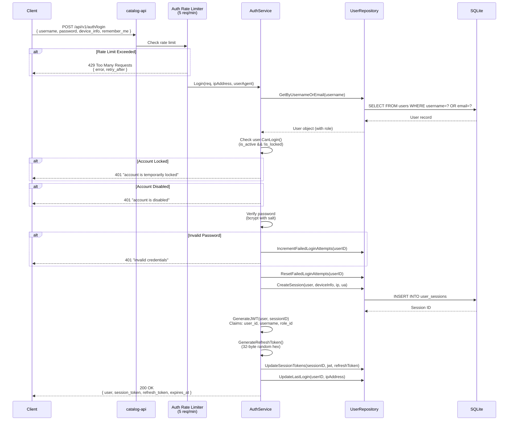
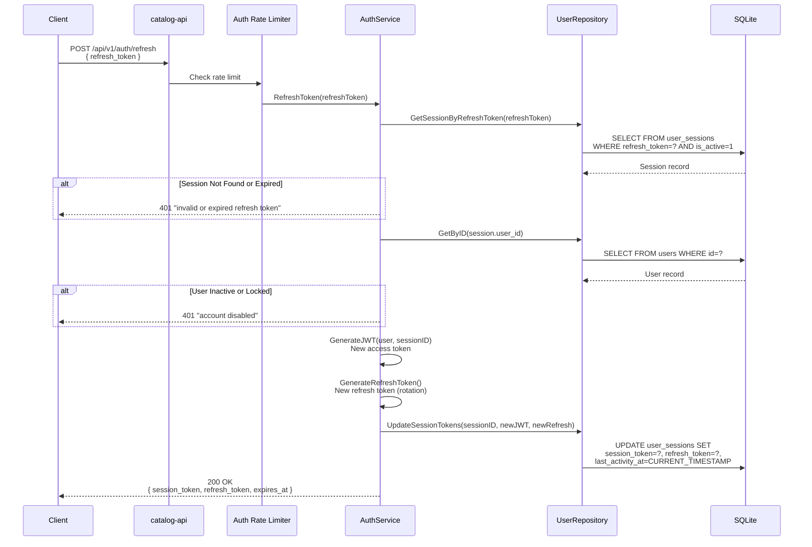
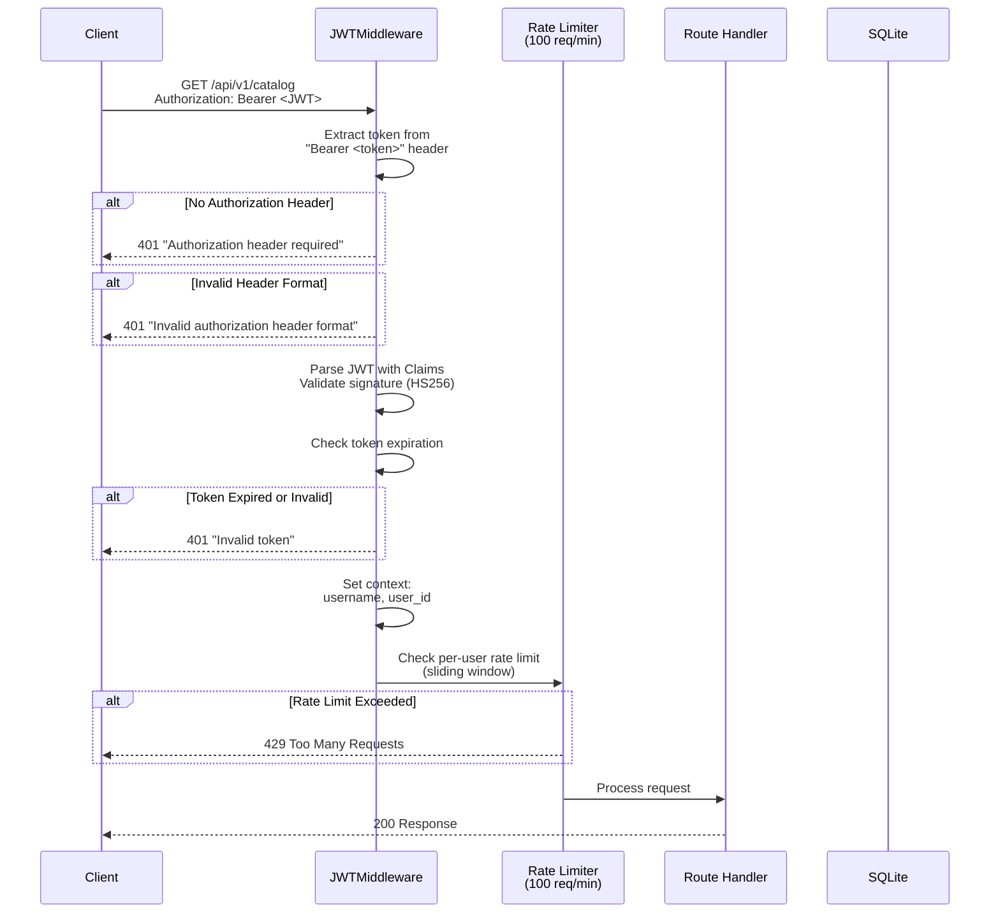
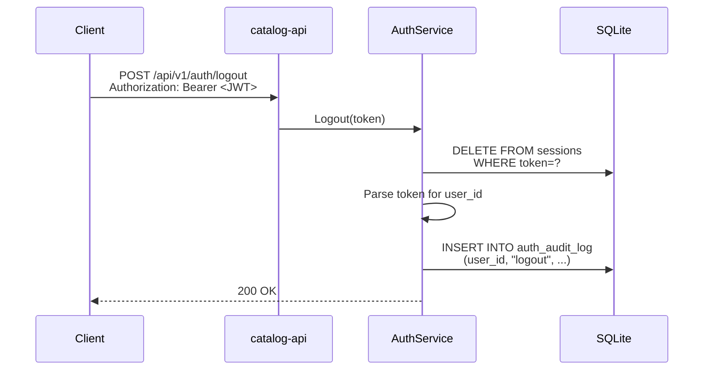
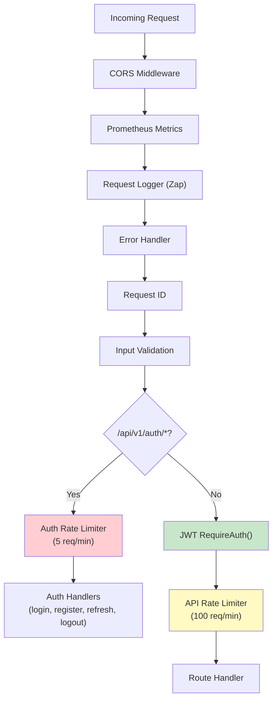

# Catalogizer Authentication Flow Documentation

This document describes the authentication and authorization system used across the Catalogizer platform, including JWT token handling, session management, role-based access control, and the dual auth service architecture.

## Overview

Catalogizer implements JWT-based authentication with two complementary auth service layers:

1. **Root Auth Service** (`catalog-api/services/auth_service.go`) -- Primary authentication for the root-level middleware. Uses salted bcrypt password hashing and the `repository.UserRepository` for data access.
2. **Internal Auth Service** (`catalog-api/internal/auth/service.go`) -- Internal authentication service with rate limiting middleware. Uses bcrypt directly and manages its own table schema.

Both services share the same JWT secret configured via `Auth.JWTSecret` in config.json or the `JWT_SECRET` environment variable.

## Login Flow



## JWT Refresh Flow



## Request Authentication Flow



## Logout Flow



## Token Structure

### Access Token (JWT)

The access token is a standard JWT signed with HMAC-SHA256 (`HS256`).

**Header:**
```json
{
  "alg": "HS256",
  "typ": "JWT"
}
```

**Payload (Claims) -- Root Auth Service:**
```json
{
  "user_id": 1,
  "username": "admin",
  "role_id": 1,
  "session_id": "sess_abc123",
  "sub": "1",
  "exp": 1705420800,
  "iat": 1705334400,
  "nbf": 1705334400,
  "iss": "catalog-api"
}
```

Defined in: `catalog-api/services/auth_service.go` -- `JWTClaims`

**Payload (Claims) -- Internal Auth Service:**
```json
{
  "user_id": 1,
  "username": "admin",
  "role": "admin",
  "permissions": [
    "read:media",
    "write:media",
    "delete:media",
    "read:catalog",
    "write:catalog",
    "delete:catalog",
    "trigger:analysis",
    "view:analysis",
    "manage:users",
    "manage:roles",
    "view:logs",
    "admin:system",
    "access:api",
    "write:api"
  ],
  "type": "access",
  "iat": 1705334400,
  "exp": 1705420800
}
```

Defined in: `catalog-api/internal/auth/models.go` -- `Claims`

### Token Lifetimes

| Token Type | Lifetime | Description |
|------------|----------|-------------|
| Access Token (JWT) | 24 hours | Short-lived token for API authentication |
| Refresh Token | 7 days | Long-lived token for obtaining new access tokens |
| Session | 24 hours | Server-side session tied to access token |

### Token Generation

- **JWT Secret**: Configured via `Auth.JWTSecret` in `config.json` or `JWT_SECRET` environment variable. If not set or set to `"change-this-secret-in-production"`, a cryptographically secure 32-byte random secret is generated at startup (ephemeral, sessions will not persist across restarts).
- **Signing Algorithm**: HMAC-SHA256 (`jwt.SigningMethodHS256`)
- **Refresh Token**: 32-byte cryptographically random hex string (via `crypto/rand`)

### Refresh Token

The refresh token is an opaque random string, not a JWT. It is stored in the `user_sessions` table alongside the access token and is used to obtain a new access/refresh token pair without re-entering credentials.

Token rotation is implemented: each refresh operation generates both a new access token and a new refresh token, invalidating the previous refresh token.

## Permission Model

### Role-Based Access Control (RBAC)

Users are assigned a role, and each role has a set of permissions. Permissions follow the `resource:action` naming convention (internal auth) or `resource.action` dot notation (root models).

### Default Roles

#### Internal Auth Service Roles

| Role | Permissions |
|------|------------|
| `admin` | `read:media`, `write:media`, `delete:media`, `read:catalog`, `write:catalog`, `delete:catalog`, `trigger:analysis`, `view:analysis`, `manage:users`, `manage:roles`, `view:logs`, `admin:system`, `access:api`, `write:api` |
| `moderator` | `read:media`, `write:media`, `read:catalog`, `write:catalog`, `trigger:analysis`, `view:analysis`, `access:api`, `write:api` |
| `user` | `read:media`, `write:media`, `read:catalog`, `write:catalog`, `view:analysis`, `access:api` |
| `viewer` | `read:media`, `read:catalog`, `view:analysis`, `access:api` |

Source: `catalog-api/internal/auth/models.go` -- `GetRolePermissions()`

#### Root Models Roles (Migration-seeded)

| Role ID | Name | Permissions |
|---------|------|------------|
| 1 | Admin | `["*"]` (wildcard -- all permissions) |
| 2 | User | `["media.view", "media.download"]` |

Source: `catalog-api/database/migrations.go` -- `createAuthTables()`

### Permission Categories

#### Internal Auth Permissions (resource:action format)

| Permission | Resource | Action | Description |
|------------|----------|--------|-------------|
| `read:media` | media | read | View media items and metadata |
| `write:media` | media | write | Create and update media items |
| `delete:media` | media | delete | Delete media items |
| `read:catalog` | catalog | read | Browse file catalog |
| `write:catalog` | catalog | write | Modify file catalog |
| `delete:catalog` | catalog | delete | Delete from catalog |
| `trigger:analysis` | analysis | trigger | Start media analysis |
| `view:analysis` | analysis | view | View analysis results |
| `manage:users` | users | manage | Create, update, delete users |
| `manage:roles` | roles | manage | Create, update, delete roles |
| `view:logs` | logs | view | View system logs |
| `admin:system` | system | admin | Full system administration |
| `access:api` | api | access | Access API endpoints |
| `write:api` | api | write | Modify data via API |

#### Root Model Permissions (resource.action format)

| Permission | Description |
|------------|-------------|
| `system.admin` | Full system administration |
| `system.configure` | System configuration access |
| `user.view/create/update/delete/manage` | User management operations |
| `media.view/upload/edit/delete/share/download/convert/manage` | Media operations |
| `share.view/create/edit/delete/manage` | Share management |
| `analytics.view/export/manage` | Analytics access |
| `favorite.view/create/delete` | Favorites management |
| `sync.view/create/execute/manage` | Sync operations |
| `conversion.view/create/manage` | Conversion job management |
| `report.view/create/export` | Report generation |
| `*` | Wildcard -- grants all permissions |

Source: `catalog-api/models/user.go` -- Permission constants

### Permission Checking

Permissions support wildcard matching:

1. **Exact match**: `"media.view"` matches `"media.view"`
2. **Wildcard**: `"*"` matches any permission
3. **Prefix wildcard**: `"media.*"` matches `"media.view"`, `"media.edit"`, etc.
4. **Admin override**: Admin role users (`admin:system` or `*`) bypass all permission checks

Source: `catalog-api/models/user.go` -- `Permissions.HasPermission()`

### Account Security

#### Failed Login Protection

- Failed login attempts are tracked per user (`failed_login_attempts` column)
- On successful login, the counter is reset to zero
- Account locking is supported via `is_locked` and `locked_until` fields
- `CanLogin()` checks both `is_active` and lock status

#### Audit Trail

All authentication events are logged to the `auth_audit_log` table:

| Event Type | Description |
|------------|-------------|
| `login_success` | Successful authentication |
| `failed_login` | Invalid credentials |
| `failed_login_inactive` | Login attempt on disabled account |
| `logout` | Session termination |
| `password_changed` | Password update |

Each audit entry captures: user_id, IP address, user agent, and additional details.

## Middleware Stack

The authentication and authorization middleware is applied in the following order:



### Middleware Details

| Middleware | Source | Description |
|-----------|--------|-------------|
| CORS | `catalog-api/middleware/request.go` | Cross-origin resource sharing headers |
| Prometheus Metrics | `catalog-api/internal/metrics/` | Request timing and counting |
| Logger | `catalog-api/internal/middleware/` | Structured request logging (Zap) |
| Error Handler | `catalog-api/internal/middleware/` | Global error recovery |
| Request ID | `catalog-api/middleware/request.go` | Unique request ID generation |
| Input Validation | `catalog-api/middleware/input_validation.go` | Request body sanitization |
| JWT RequireAuth | `catalog-api/middleware/auth.go` | Token extraction and validation |
| Rate Limiter | `catalog-api/internal/auth/middleware.go` | Per-user sliding window rate limiting |

### Rate Limiting

Two rate limiting tiers are applied:

| Tier | Endpoints | Limit | Window | Implementation |
|------|-----------|-------|--------|---------------|
| Auth | `/api/v1/auth/*` | 5 requests | 1 minute | In-memory sliding window per user |
| API | `/api/v1/*` (authenticated) | 100 requests | 1 minute | In-memory sliding window per user |

The rate limiter uses an in-memory sliding window algorithm. Redis-based distributed rate limiting is available when Redis is configured (`REDIS_ADDR` environment variable), but falls back to in-memory when Redis is unavailable.

Source: `catalog-api/internal/auth/middleware.go` -- `RateLimitByUser()`

## API Endpoints

| Method | Path | Auth Required | Description |
|--------|------|---------------|-------------|
| POST | `/api/v1/auth/login` | No | Authenticate and get tokens |
| POST | `/api/v1/auth/register` | No | Create new user account |
| POST | `/api/v1/auth/refresh` | No | Refresh access token |
| POST | `/api/v1/auth/logout` | No | Invalidate session |
| GET | `/api/v1/auth/me` | Yes | Get current user info |

All other `/api/v1/*` routes require a valid JWT in the `Authorization: Bearer <token>` header.
