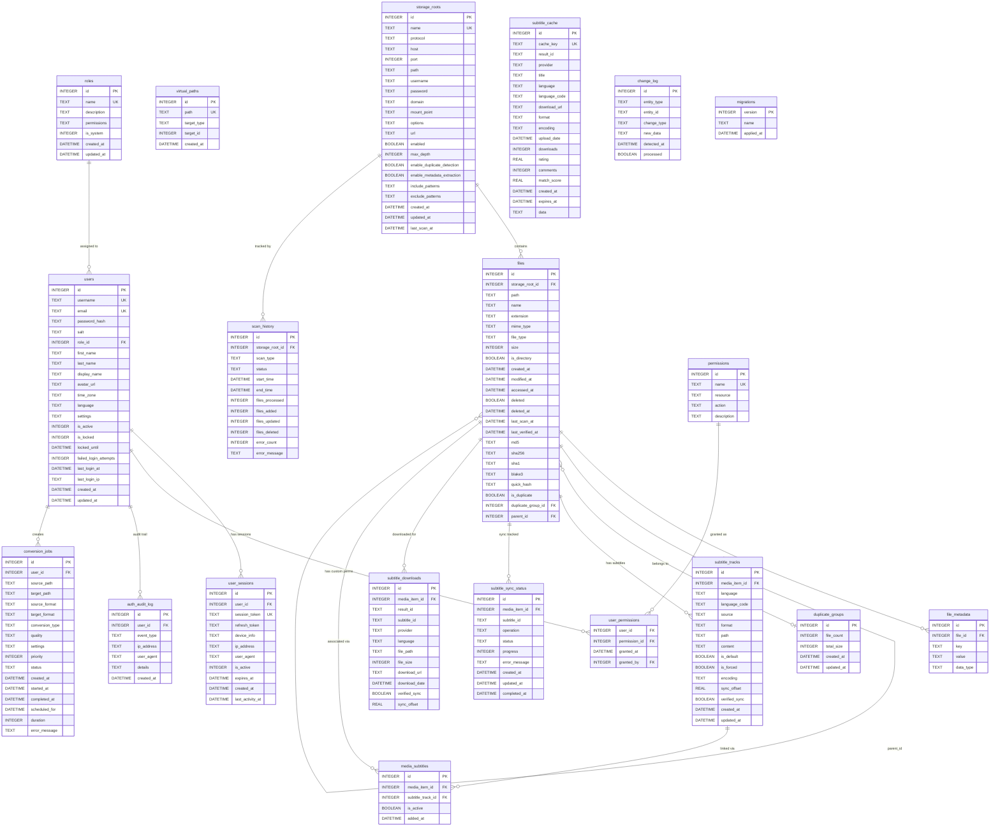

# Catalogizer Database Schema

This document describes the complete database schema for the Catalogizer system. The database uses SQLite (with optional SQLCipher encryption) and is managed through versioned migrations defined in `catalog-api/database/migrations.go`.

## ER Diagram

## Table Descriptions

### Core File Catalog Tables

#### storage_roots

Unified storage root configuration supporting multiple protocols (SMB, FTP, NFS, WebDAV, Local). Replaces the legacy `smb_roots` table.

| Column | Type | Nullable | Default | Description |
|--------|------|----------|---------|-------------|
| id | INTEGER | No | AUTOINCREMENT | Primary key |
| name | TEXT | No | - | Unique human-readable name |
| protocol | TEXT | No | - | Protocol type: `smb`, `ftp`, `nfs`, `webdav`, `local` |
| host | TEXT | Yes | NULL | Server hostname/IP (not used for local) |
| port | INTEGER | Yes | NULL | Server port (protocol-specific default if omitted) |
| path | TEXT | Yes | NULL | Share name (SMB), remote path (FTP/NFS/WebDAV), base path (local) |
| username | TEXT | Yes | NULL | Authentication username |
| password | TEXT | Yes | NULL | Authentication password |
| domain | TEXT | Yes | NULL | SMB domain/workgroup |
| mount_point | TEXT | Yes | NULL | NFS local mount point |
| options | TEXT | Yes | NULL | Protocol-specific options (e.g., NFS mount options) |
| url | TEXT | Yes | NULL | WebDAV endpoint URL |
| enabled | BOOLEAN | No | 1 | Whether this root is active for scanning |
| max_depth | INTEGER | No | 10 | Maximum directory traversal depth |
| enable_duplicate_detection | BOOLEAN | No | 1 | Run hash-based duplicate detection |
| enable_metadata_extraction | BOOLEAN | No | 1 | Extract file metadata during scanning |
| include_patterns | TEXT | Yes | NULL | Glob patterns for files to include |
| exclude_patterns | TEXT | Yes | NULL | Glob patterns for files to exclude |
| created_at | DATETIME | No | CURRENT_TIMESTAMP | Record creation time |
| updated_at | DATETIME | No | CURRENT_TIMESTAMP | Last update time |
| last_scan_at | DATETIME | Yes | NULL | Last successful scan time |

#### files

Central file catalog storing all discovered files across all storage roots.

| Column | Type | Nullable | Default | Description |
|--------|------|----------|---------|-------------|
| id | INTEGER | No | AUTOINCREMENT | Primary key |
| storage_root_id | INTEGER | No | - | FK to storage_roots |
| path | TEXT | No | - | Relative path within storage root |
| name | TEXT | No | - | File or directory name |
| extension | TEXT | Yes | NULL | File extension (without dot) |
| mime_type | TEXT | Yes | NULL | Detected MIME type |
| file_type | TEXT | Yes | NULL | Categorized type: video, audio, image, text, book, game, other |
| size | INTEGER | No | - | File size in bytes |
| is_directory | BOOLEAN | No | 0 | Whether this entry is a directory |
| created_at | DATETIME | No | CURRENT_TIMESTAMP | Record creation time |
| modified_at | DATETIME | No | - | File last modification time |
| accessed_at | DATETIME | Yes | NULL | File last access time |
| deleted | BOOLEAN | No | 0 | Soft-delete flag |
| deleted_at | DATETIME | Yes | NULL | When the file was marked deleted |
| last_scan_at | DATETIME | No | CURRENT_TIMESTAMP | Last time file was verified during scan |
| last_verified_at | DATETIME | Yes | NULL | Last integrity verification time |
| md5 | TEXT | Yes | NULL | MD5 hash |
| sha256 | TEXT | Yes | NULL | SHA-256 hash |
| sha1 | TEXT | Yes | NULL | SHA-1 hash |
| blake3 | TEXT | Yes | NULL | BLAKE3 hash |
| quick_hash | TEXT | Yes | NULL | Partial/fast hash for quick comparison |
| is_duplicate | BOOLEAN | No | 0 | Whether this file has known duplicates |
| duplicate_group_id | INTEGER | Yes | NULL | FK to duplicate_groups |
| parent_id | INTEGER | Yes | NULL | FK to files (parent directory) |

#### file_metadata

Key-value metadata store for file attributes discovered during scanning.

| Column | Type | Nullable | Default | Description |
|--------|------|----------|---------|-------------|
| id | INTEGER | No | AUTOINCREMENT | Primary key |
| file_id | INTEGER | No | - | FK to files (CASCADE delete) |
| key | TEXT | No | - | Metadata key name |
| value | TEXT | No | - | Metadata value |
| data_type | TEXT | No | 'string' | Value type: string, integer, float, boolean, json |

#### duplicate_groups

Groups of files identified as duplicates based on hash matching.

| Column | Type | Nullable | Default | Description |
|--------|------|----------|---------|-------------|
| id | INTEGER | No | AUTOINCREMENT | Primary key |
| file_count | INTEGER | No | 0 | Number of files in group |
| total_size | INTEGER | No | 0 | Combined size of all duplicates |
| created_at | DATETIME | No | CURRENT_TIMESTAMP | When the group was first identified |
| updated_at | DATETIME | No | CURRENT_TIMESTAMP | Last update time |

#### virtual_paths

Virtual file system paths that map to files or storage roots for unified navigation.

| Column | Type | Nullable | Default | Description |
|--------|------|----------|---------|-------------|
| id | INTEGER | No | AUTOINCREMENT | Primary key |
| path | TEXT | No | - | Virtual path (unique) |
| target_type | TEXT | No | - | Target entity type |
| target_id | INTEGER | No | - | Target entity ID |
| created_at | DATETIME | No | CURRENT_TIMESTAMP | Creation time |

#### scan_history

Audit trail of all scan operations performed on storage roots.

| Column | Type | Nullable | Default | Description |
|--------|------|----------|---------|-------------|
| id | INTEGER | No | AUTOINCREMENT | Primary key |
| storage_root_id | INTEGER | No | - | FK to storage_roots |
| scan_type | TEXT | No | - | Type of scan: full, incremental, verify |
| status | TEXT | No | - | Status: running, completed, failed |
| start_time | DATETIME | No | - | Scan start time |
| end_time | DATETIME | Yes | NULL | Scan completion time |
| files_processed | INTEGER | No | 0 | Total files examined |
| files_added | INTEGER | No | 0 | New files discovered |
| files_updated | INTEGER | No | 0 | Files with changed metadata |
| files_deleted | INTEGER | No | 0 | Files marked as deleted |
| error_count | INTEGER | No | 0 | Number of errors during scan |
| error_message | TEXT | Yes | NULL | Error details if failed |

### Authentication and Authorization Tables

#### users

User accounts with profile information, security settings, and login tracking.

| Column | Type | Nullable | Default | Description |
|--------|------|----------|---------|-------------|
| id | INTEGER | No | AUTOINCREMENT | Primary key |
| username | TEXT | No | - | Unique username |
| email | TEXT | No | - | Unique email address |
| password_hash | TEXT | No | - | bcrypt password hash |
| salt | TEXT | No | - | Password salt |
| role_id | INTEGER | No | - | FK to roles |
| first_name | TEXT | Yes | NULL | First name |
| last_name | TEXT | Yes | NULL | Last name |
| display_name | TEXT | Yes | NULL | Display name |
| avatar_url | TEXT | Yes | NULL | Profile avatar URL |
| time_zone | TEXT | Yes | NULL | User timezone |
| language | TEXT | Yes | NULL | Preferred language |
| settings | TEXT | No | '{}' | JSON user settings/preferences |
| is_active | INTEGER | No | 1 | Account active flag |
| is_locked | INTEGER | No | 0 | Account locked flag |
| locked_until | DATETIME | Yes | NULL | Lock expiration time |
| failed_login_attempts | INTEGER | No | 0 | Consecutive failed logins |
| last_login_at | DATETIME | Yes | NULL | Last successful login time |
| last_login_ip | TEXT | Yes | NULL | IP address of last login |
| created_at | DATETIME | No | CURRENT_TIMESTAMP | Account creation time |
| updated_at | DATETIME | No | CURRENT_TIMESTAMP | Last profile update time |

#### roles

Role definitions with associated permission sets. System roles (Admin, User) are seeded automatically.

| Column | Type | Nullable | Default | Description |
|--------|------|----------|---------|-------------|
| id | INTEGER | No | AUTOINCREMENT | Primary key |
| name | TEXT | No | - | Unique role name |
| description | TEXT | Yes | NULL | Role description |
| permissions | TEXT | No | '[]' | JSON array of permission strings |
| is_system | INTEGER | No | 0 | System role (cannot be deleted) |
| created_at | DATETIME | No | CURRENT_TIMESTAMP | Creation time |
| updated_at | DATETIME | No | CURRENT_TIMESTAMP | Last update time |

Default roles seeded at migration 3:
- **Admin** (id=1): `["*"]` -- full wildcard permissions
- **User** (id=2): `["media.view", "media.download"]` -- basic access

#### user_sessions

Active user sessions tracking device info, tokens, and activity.

| Column | Type | Nullable | Default | Description |
|--------|------|----------|---------|-------------|
| id | INTEGER | No | AUTOINCREMENT | Primary key |
| user_id | INTEGER | No | - | FK to users (CASCADE delete) |
| session_token | TEXT | No | - | JWT access token (unique) |
| refresh_token | TEXT | Yes | NULL | Refresh token for re-authentication |
| device_info | TEXT | Yes | NULL | JSON device metadata |
| ip_address | TEXT | Yes | NULL | Client IP address |
| user_agent | TEXT | Yes | NULL | Client user agent string |
| is_active | INTEGER | No | 1 | Whether session is valid |
| expires_at | DATETIME | No | - | Token expiration time |
| created_at | DATETIME | No | CURRENT_TIMESTAMP | Session creation time |
| last_activity_at | DATETIME | No | CURRENT_TIMESTAMP | Last request time |

#### permissions

Granular permission definitions using resource:action naming convention.

| Column | Type | Nullable | Default | Description |
|--------|------|----------|---------|-------------|
| id | INTEGER | No | AUTOINCREMENT | Primary key |
| name | TEXT | No | - | Unique permission identifier (e.g., `read:media`) |
| resource | TEXT | No | - | Resource name (media, catalog, users, etc.) |
| action | TEXT | No | - | Action type (read, write, delete, manage, etc.) |
| description | TEXT | Yes | NULL | Human-readable description |

#### user_permissions

Junction table for assigning individual permissions to users beyond their role.

| Column | Type | Nullable | Default | Description |
|--------|------|----------|---------|-------------|
| user_id | INTEGER | No | - | FK to users (CASCADE delete, part of PK) |
| permission_id | INTEGER | No | - | FK to permissions (CASCADE delete, part of PK) |
| granted_at | DATETIME | No | CURRENT_TIMESTAMP | When the permission was granted |
| granted_by | INTEGER | Yes | NULL | FK to users (who granted this) |

#### auth_audit_log

Audit trail for all authentication-related events.

| Column | Type | Nullable | Default | Description |
|--------|------|----------|---------|-------------|
| id | INTEGER | No | AUTOINCREMENT | Primary key |
| user_id | INTEGER | Yes | NULL | FK to users (NULL for failed attempts with unknown user) |
| event_type | TEXT | No | - | Event: login_success, failed_login, logout, password_changed, etc. |
| ip_address | TEXT | Yes | NULL | Client IP address |
| user_agent | TEXT | Yes | NULL | Client user agent |
| details | TEXT | Yes | NULL | JSON additional context |
| created_at | DATETIME | No | CURRENT_TIMESTAMP | Event timestamp |

### Media Conversion Tables

#### conversion_jobs

Media format conversion job queue and tracking.

| Column | Type | Nullable | Default | Description |
|--------|------|----------|---------|-------------|
| id | INTEGER | No | AUTOINCREMENT | Primary key |
| user_id | INTEGER | No | - | FK to users (CASCADE delete) |
| source_path | TEXT | No | - | Source file path |
| target_path | TEXT | No | - | Output file path |
| source_format | TEXT | No | - | Input format (mp4, avi, mp3, etc.) |
| target_format | TEXT | No | - | Output format |
| conversion_type | TEXT | No | - | Type: video, audio, document, image |
| quality | TEXT | No | 'medium' | Quality preset: low, medium, high |
| settings | TEXT | Yes | NULL | JSON additional conversion settings |
| priority | INTEGER | No | 0 | Job priority (higher = more urgent) |
| status | TEXT | No | 'pending' | Status: pending, running, completed, failed, cancelled |
| created_at | DATETIME | No | CURRENT_TIMESTAMP | Job creation time |
| started_at | DATETIME | Yes | NULL | Processing start time |
| completed_at | DATETIME | Yes | NULL | Processing completion time |
| scheduled_for | DATETIME | Yes | NULL | Deferred execution time |
| duration | INTEGER | Yes | NULL | Processing duration in seconds |
| error_message | TEXT | Yes | NULL | Error details if failed |

### Subtitle Tables

#### subtitle_tracks

Subtitle track records associated with media files.

| Column | Type | Nullable | Default | Description |
|--------|------|----------|---------|-------------|
| id | INTEGER | No | AUTOINCREMENT | Primary key |
| media_item_id | INTEGER | No | - | FK to files (CASCADE delete) |
| language | TEXT | No | - | Full language name |
| language_code | TEXT | No | - | ISO language code (e.g., en, fr, de) |
| source | TEXT | No | 'downloaded' | Source: downloaded, uploaded, embedded, generated |
| format | TEXT | No | 'srt' | Format: srt, ass, ssa, vtt |
| path | TEXT | Yes | NULL | File path on disk |
| content | TEXT | Yes | NULL | Inline subtitle content |
| is_default | BOOLEAN | No | FALSE | Default subtitle track |
| is_forced | BOOLEAN | No | FALSE | Forced subtitle flag |
| encoding | TEXT | No | 'utf-8' | Text encoding |
| sync_offset | REAL | No | 0.0 | Timing offset in seconds |
| verified_sync | BOOLEAN | No | FALSE | Whether sync has been verified |
| created_at | DATETIME | No | CURRENT_TIMESTAMP | Creation time |
| updated_at | DATETIME | No | CURRENT_TIMESTAMP | Last update (via trigger) |

#### subtitle_sync_status

Tracks asynchronous subtitle processing operations.

| Column | Type | Nullable | Default | Description |
|--------|------|----------|---------|-------------|
| id | INTEGER | No | AUTOINCREMENT | Primary key |
| media_item_id | INTEGER | No | - | FK to files (CASCADE delete) |
| subtitle_id | TEXT | No | - | External subtitle identifier |
| operation | TEXT | No | - | Operation type (download, sync, translate) |
| status | TEXT | No | 'pending' | Status: pending, in_progress, completed, failed |
| progress | INTEGER | No | 0 | Completion percentage (0-100) |
| error_message | TEXT | Yes | NULL | Error details |
| created_at | DATETIME | No | CURRENT_TIMESTAMP | Operation start |
| updated_at | DATETIME | No | CURRENT_TIMESTAMP | Last status update (via trigger) |
| completed_at | DATETIME | Yes | NULL | Completion time (set via trigger) |

#### subtitle_cache

Temporary cache for subtitle search results to reduce external API calls.

| Column | Type | Nullable | Default | Description |
|--------|------|----------|---------|-------------|
| id | INTEGER | No | AUTOINCREMENT | Primary key |
| cache_key | TEXT | No | - | Unique cache key |
| result_id | TEXT | No | - | External result identifier |
| provider | TEXT | No | - | Provider name (opensubtitles, etc.) |
| title | TEXT | Yes | NULL | Subtitle title |
| language | TEXT | Yes | NULL | Language name |
| language_code | TEXT | Yes | NULL | ISO language code |
| download_url | TEXT | Yes | NULL | Download URL |
| format | TEXT | Yes | NULL | Subtitle format |
| encoding | TEXT | Yes | NULL | Text encoding |
| upload_date | DATETIME | Yes | NULL | When uploaded to provider |
| downloads | INTEGER | Yes | NULL | Download count |
| rating | REAL | Yes | NULL | User rating |
| comments | INTEGER | Yes | NULL | Comment count |
| match_score | REAL | Yes | NULL | Relevance score |
| created_at | DATETIME | No | CURRENT_TIMESTAMP | Cache entry time |
| expires_at | DATETIME | No | CURRENT_TIMESTAMP | Cache expiration |
| data | TEXT | Yes | NULL | JSON additional data |

#### subtitle_downloads

History of subtitle downloads for tracking and deduplication.

| Column | Type | Nullable | Default | Description |
|--------|------|----------|---------|-------------|
| id | INTEGER | No | AUTOINCREMENT | Primary key |
| media_item_id | INTEGER | No | - | FK to files (CASCADE delete) |
| result_id | TEXT | No | - | External result ID |
| subtitle_id | TEXT | No | - | External subtitle ID |
| provider | TEXT | No | - | Provider name |
| language | TEXT | No | - | Language name |
| file_path | TEXT | Yes | NULL | Local file path |
| file_size | INTEGER | Yes | NULL | File size in bytes |
| download_url | TEXT | Yes | NULL | Source download URL |
| download_date | DATETIME | No | CURRENT_TIMESTAMP | Download time |
| verified_sync | BOOLEAN | No | FALSE | Sync verification status |
| sync_offset | REAL | No | 0.0 | Applied timing offset |

#### media_subtitles

Many-to-many association between media files and subtitle tracks.

| Column | Type | Nullable | Default | Description |
|--------|------|----------|---------|-------------|
| id | INTEGER | No | AUTOINCREMENT | Primary key |
| media_item_id | INTEGER | No | - | FK to files (CASCADE delete) |
| subtitle_track_id | INTEGER | No | - | FK to subtitle_tracks (CASCADE delete) |
| is_active | BOOLEAN | No | TRUE | Whether this association is active |
| added_at | DATETIME | No | CURRENT_TIMESTAMP | Association time |

Unique constraint on (media_item_id, subtitle_track_id).

### System Tables

#### change_log

File system change event log used by the real-time watchers for tracking and replay.

| Column | Type | Nullable | Default | Description |
|--------|------|----------|---------|-------------|
| id | INTEGER | No | AUTOINCREMENT | Primary key |
| entity_type | TEXT | No | - | Entity type (always "file") |
| entity_id | TEXT | No | - | File path |
| change_type | TEXT | No | - | Operation: created, modified, deleted, moved |
| new_data | TEXT | No | - | JSON event metadata |
| detected_at | DATETIME | No | - | When the change was detected |
| processed | BOOLEAN | No | FALSE | Whether the change has been processed |

#### migrations

Schema version tracking table used by the migration system.

| Column | Type | Nullable | Default | Description |
|--------|------|----------|---------|-------------|
| version | INTEGER | No | - | Migration version number (PK) |
| name | TEXT | No | - | Migration name |
| applied_at | DATETIME | No | CURRENT_TIMESTAMP | When the migration was applied |

## Index Documentation

### File Catalog Indexes

| Index Name | Table | Columns | Purpose |
|------------|-------|---------|---------|
| idx_files_storage_root_path | files | storage_root_id, path | Fast file lookup by storage root and path |
| idx_files_parent_id | files | parent_id | Efficient directory listing |
| idx_files_duplicate_group | files | duplicate_group_id | Duplicate group member lookup |
| idx_files_deleted | files | deleted | Filter active vs soft-deleted files |
| idx_file_metadata_file_id | file_metadata | file_id | Metadata lookup by file |
| idx_scan_history_storage_root | scan_history | storage_root_id | Scan history by storage root |

### Authentication Indexes

| Index Name | Table | Columns | Purpose |
|------------|-------|---------|---------|
| idx_users_username | users | username | Fast username lookup during login |
| idx_users_email | users | email | Fast email lookup during login |
| idx_users_role_id | users | role_id | Users by role queries |
| idx_users_is_active | users | is_active | Active user filtering |
| idx_user_sessions_user_id | user_sessions | user_id | Sessions by user lookup |
| idx_user_sessions_token | user_sessions | session_token | Token validation |
| idx_user_sessions_expires_at | user_sessions | expires_at | Session expiration cleanup |

### Conversion Job Indexes

| Index Name | Table | Columns | Purpose |
|------------|-------|---------|---------|
| idx_conversion_jobs_user_id | conversion_jobs | user_id | Jobs by user |
| idx_conversion_jobs_status | conversion_jobs | status | Job queue processing |
| idx_conversion_jobs_created_at | conversion_jobs | created_at | Chronological ordering |

### Subtitle Indexes

| Index Name | Table | Columns | Purpose |
|------------|-------|---------|---------|
| idx_subtitle_tracks_media_item_id | subtitle_tracks | media_item_id | Subtitles by media file |
| idx_subtitle_tracks_language | subtitle_tracks | language | Language filtering |
| idx_subtitle_tracks_language_code | subtitle_tracks | language_code | ISO code filtering |
| idx_subtitle_tracks_source | subtitle_tracks | source | Source type filtering |
| idx_subtitle_sync_status_media_item_id | subtitle_sync_status | media_item_id | Sync status by media |
| idx_subtitle_sync_status_status | subtitle_sync_status | status | Pending operation queries |
| idx_subtitle_sync_status_operation | subtitle_sync_status | operation | Operation type filtering |
| idx_subtitle_cache_cache_key | subtitle_cache | cache_key | Cache lookup |
| idx_subtitle_cache_expires_at | subtitle_cache | expires_at | Cache expiration cleanup |
| idx_subtitle_downloads_media_item_id | subtitle_downloads | media_item_id | Downloads by media |
| idx_subtitle_downloads_result_id | subtitle_downloads | result_id | Deduplication check |
| idx_subtitle_downloads_subtitle_id | subtitle_downloads | subtitle_id | Subtitle lookup |
| idx_subtitle_downloads_provider | subtitle_downloads | provider | Provider statistics |
| idx_subtitle_downloads_language | subtitle_downloads | language | Language statistics |
| idx_subtitle_downloads_download_date | subtitle_downloads | download_date | Chronological ordering |
| idx_media_subtitles_media_item_id | media_subtitles | media_item_id | Association lookup |
| idx_media_subtitles_subtitle_track_id | media_subtitles | subtitle_track_id | Reverse association lookup |
| idx_media_subtitles_is_active | media_subtitles | is_active | Active subtitle filtering |

### Auth Audit Log Indexes

| Index Name | Table | Columns | Purpose |
|------------|-------|---------|---------|
| idx_auth_audit_user_id | auth_audit_log | user_id | Audit trail by user |
| idx_auth_audit_event_type | auth_audit_log | event_type | Event type filtering |
| idx_auth_audit_created_at | auth_audit_log | created_at | Chronological querying |

## Database Triggers

| Trigger Name | Table | Event | Description |
|--------------|-------|-------|-------------|
| update_subtitle_tracks_updated_at | subtitle_tracks | AFTER UPDATE | Auto-update the `updated_at` timestamp |
| update_subtitle_sync_status_updated_at | subtitle_sync_status | AFTER UPDATE | Auto-update the `updated_at` timestamp |
| set_subtitle_sync_status_completed_at | subtitle_sync_status | AFTER UPDATE | Set `completed_at` when status changes to 'completed' |

## Migration History

| Version | Name | Description |
|---------|------|-------------|
| 1 | create_initial_tables | Core schema: storage_roots, files, file_metadata, duplicate_groups, virtual_paths, scan_history |
| 2 | migrate_smb_to_storage_roots | Migrates legacy smb_roots data to the unified storage_roots table |
| 3 | create_auth_tables | Authentication: users, roles, user_sessions, permissions, user_permissions, auth_audit_log |
| 4 | create_conversion_jobs_table | Media conversion job queue |
| 5 | create_subtitle_tables | Subtitle management: tracks, sync status, cache, downloads, associations |
| 6 | fix_subtitle_foreign_keys | Corrects subtitle table foreign keys to reference files instead of media_items |
