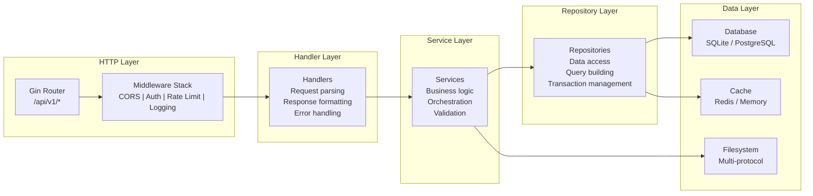
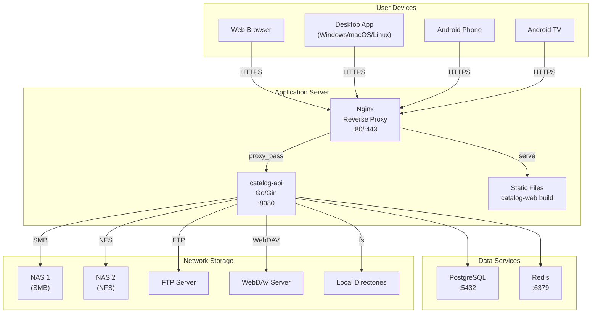
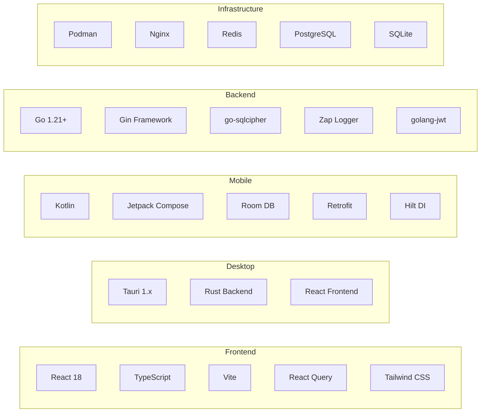

# Catalogizer System Architecture Diagram

High-level system architecture showing all components, their interactions, and technology stack.

## Rendered SVG Diagrams

| Diagram | SVG |
|---------|-----|
| System Overview |  |
| Backend Layered Architecture |  |
| Deployment Architecture |  |
| Technology Stack |  |

## System Overview

```mermaid
graph TB
    subgraph "Client Applications"
        WEB["catalog-web<br/>(React + TypeScript)<br/>:5173"]
        DESKTOP["catalogizer-desktop<br/>(Tauri + React)<br/>Rust IPC"]
        ANDROID["catalogizer-android<br/>(Kotlin + Compose)<br/>Hilt DI"]
        ANDROIDTV["catalogizer-androidtv<br/>(Kotlin + Compose)<br/>Leanback"]
        INSTALLER["installer-wizard<br/>(Tauri + React)<br/>Setup Tool"]
    end

    subgraph "Shared Libraries"
        APICLIENT["catalogizer-api-client<br/>(TypeScript Library)"]
        WSCLIENT["@vasic-digital/websocket-client<br/>(TypeScript + React Hooks)"]
        UICOMP["@vasic-digital/ui-components<br/>(React Component Library)"]
        ANDROIDTOOLKIT["Android-Toolkit<br/>(Kotlin Utilities)"]
    end

    subgraph "Backend API"
        GIN["Gin HTTP Router<br/>:8080"]
        AUTH["Auth Middleware<br/>(JWT + RBAC)"]
        RATELIMIT["Rate Limiter<br/>(Sliding Window)"]
        MIDDLEWARE["HTTP Middleware<br/>(CORS, Logging, Recovery)"]

        subgraph "Handlers"
            CATALOG_H["Catalog Handler"]
            DOWNLOAD_H["Download Handler"]
            MEDIA_H["Media Handler"]
            AUTH_H["Auth Handler"]
            CONV_H["Conversion Handler"]
            SUB_H["Subtitle Handler"]
            REC_H["Recommendation Handler"]
            STATS_H["Stats Handler"]
            ADMIN_H["Admin Handler"]
        end

        subgraph "Services"
            CATALOG_S["Catalog Service"]
            SMB_S["SMB Service"]
            DISCOVERY_S["Discovery Service"]
            MEDIA_REC_S["Media Recognition"]
            DUP_S["Duplicate Detection"]
            CONV_S["Conversion Service"]
            SUB_S["Subtitle Service"]
            CACHE_S["Cache Service"]
            ANALYTICS_S["Analytics Service"]
            FAV_S["Favorites Service"]
        end

        subgraph "Repositories"
            FILE_R["File Repository"]
            USER_R["User Repository"]
            CONV_R["Conversion Repository"]
            ANALYTICS_R["Analytics Repository"]
            CONFIG_R["Configuration Repository"]
            FAV_R["Favorites Repository"]
            STATS_R["Stats Repository"]
        end
    end

    subgraph "Media Detection Pipeline"
        DETECTOR["Media Detector"]
        ANALYZER["Content Analyzer"]
        subgraph "Recognition Providers"
            TMDB["TMDB Provider"]
            IMDB["IMDB Provider"]
            MUSICBRAINZ["MusicBrainz Provider"]
            IGDB["IGDB Provider"]
        end
    end

    subgraph "Real-Time System"
        EVENTBUS["Event Bus<br/>(Pub/Sub)"]
        WATCHER["Filesystem Watcher<br/>(Debounce + Filter)"]
        WSSERVER["WebSocket Server<br/>(SSE + WS)"]
    end

    subgraph "Storage Protocols"
        SMB_P["SMB/CIFS<br/>(Circuit Breaker)"]
        FTP_P["FTP/FTPS"]
        NFS_P["NFS"]
        WEBDAV_P["WebDAV"]
        LOCAL_P["Local Filesystem"]
    end

    subgraph "Data Layer"
        SQLITE["SQLite<br/>(Development)"]
        SQLCIPHER["SQLCipher<br/>(Media Detection DB)"]
        POSTGRES["PostgreSQL<br/>(Production)"]
        REDIS["Redis<br/>(Rate Limiting + Cache)"]
    end

    subgraph "External Services"
        TMDB_API["TMDB API"]
        OMDB_API["OMDB API"]
        OPENSUBTITLES["OpenSubtitles API"]
    end

    %% Client to API connections
    WEB -->|"HTTP/REST"| GIN
    WEB -->|"WebSocket"| WSSERVER
    DESKTOP -->|"HTTP/REST"| GIN
    DESKTOP -->|"Tauri IPC"| DESKTOP
    ANDROID -->|"HTTP/REST"| GIN
    ANDROIDTV -->|"HTTP/REST"| GIN
    INSTALLER -->|"HTTP/REST"| GIN

    %% Shared library usage
    WEB -.->|"uses"| APICLIENT
    WEB -.->|"uses"| WSCLIENT
    WEB -.->|"uses"| UICOMP
    DESKTOP -.->|"uses"| APICLIENT
    DESKTOP -.->|"uses"| WSCLIENT
    INSTALLER -.->|"uses"| UICOMP
    ANDROID -.->|"uses"| ANDROIDTOOLKIT
    ANDROIDTV -.->|"uses"| ANDROIDTOOLKIT

    %% API request flow
    GIN --> AUTH
    GIN --> RATELIMIT
    GIN --> MIDDLEWARE
    AUTH --> CATALOG_H
    AUTH --> DOWNLOAD_H
    AUTH --> MEDIA_H
    AUTH --> AUTH_H
    AUTH --> CONV_H
    AUTH --> SUB_H
    AUTH --> REC_H
    AUTH --> STATS_H
    AUTH --> ADMIN_H

    %% Handler to Service
    CATALOG_H --> CATALOG_S
    CATALOG_H --> SMB_S
    DOWNLOAD_H --> CATALOG_S
    MEDIA_H --> MEDIA_REC_S
    CONV_H --> CONV_S
    SUB_H --> SUB_S
    REC_H --> MEDIA_REC_S
    REC_H --> DUP_S

    %% Service to Repository
    CATALOG_S --> FILE_R
    CONV_S --> CONV_R
    CONV_S --> USER_R
    ANALYTICS_S --> ANALYTICS_R
    FAV_S --> FAV_R
    STATS_H --> STATS_R

    %% Media Detection
    MEDIA_REC_S --> DETECTOR
    DETECTOR --> ANALYZER
    ANALYZER --> TMDB
    ANALYZER --> IMDB
    ANALYZER --> MUSICBRAINZ
    ANALYZER --> IGDB

    %% External API calls
    TMDB -->|"REST"| TMDB_API
    IMDB -->|"REST"| OMDB_API
    SUB_S -->|"REST"| OPENSUBTITLES

    %% Real-time
    WATCHER --> EVENTBUS
    EVENTBUS --> WSSERVER
    CATALOG_S --> WATCHER

    %% Storage access
    CATALOG_S --> SMB_P
    CATALOG_S --> FTP_P
    CATALOG_S --> NFS_P
    CATALOG_S --> WEBDAV_P
    CATALOG_S --> LOCAL_P

    %% Data layer
    FILE_R --> SQLITE
    FILE_R --> POSTGRES
    USER_R --> SQLITE
    CONV_R --> SQLITE
    ANALYTICS_R --> SQLITE
    MEDIA_REC_S --> SQLCIPHER
    RATELIMIT --> REDIS
    CACHE_S --> REDIS

    classDef client fill:#4A90D9,stroke:#2C5F8A,color:#fff
    classDef lib fill:#7B68EE,stroke:#5B48CE,color:#fff
    classDef api fill:#50C878,stroke:#2E8B57,color:#fff
    classDef handler fill:#66CDAA,stroke:#3CB371,color:#000
    classDef service fill:#FFD700,stroke:#DAA520,color:#000
    classDef repo fill:#FFA07A,stroke:#E9967A,color:#000
    classDef storage fill:#DDA0DD,stroke:#BA55D3,color:#000
    classDef data fill:#87CEEB,stroke:#4682B4,color:#000
    classDef external fill:#F0E68C,stroke:#BDB76B,color:#000

    class WEB,DESKTOP,ANDROID,ANDROIDTV,INSTALLER client
    class APICLIENT,WSCLIENT,UICOMP,ANDROIDTOOLKIT lib
    class GIN,AUTH,RATELIMIT,MIDDLEWARE api
    class CATALOG_H,DOWNLOAD_H,MEDIA_H,AUTH_H,CONV_H,SUB_H,REC_H,STATS_H,ADMIN_H handler
    class CATALOG_S,SMB_S,DISCOVERY_S,MEDIA_REC_S,DUP_S,CONV_S,SUB_S,CACHE_S,ANALYTICS_S,FAV_S service
    class FILE_R,USER_R,CONV_R,ANALYTICS_R,CONFIG_R,FAV_R,STATS_R repo
    class SMB_P,FTP_P,NFS_P,WEBDAV_P,LOCAL_P storage
    class SQLITE,SQLCIPHER,POSTGRES,REDIS data
    class TMDB_API,OMDB_API,OPENSUBTITLES external
```

## Backend Layered Architecture

## Deployment Architecture

## Technology Stack

