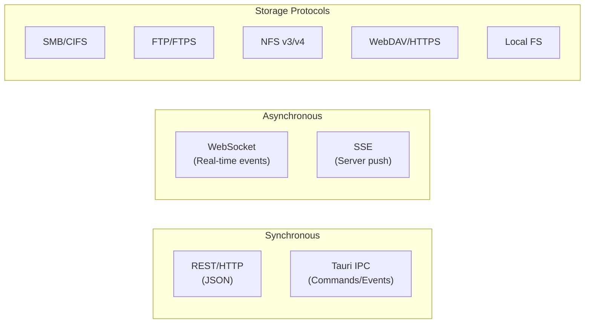
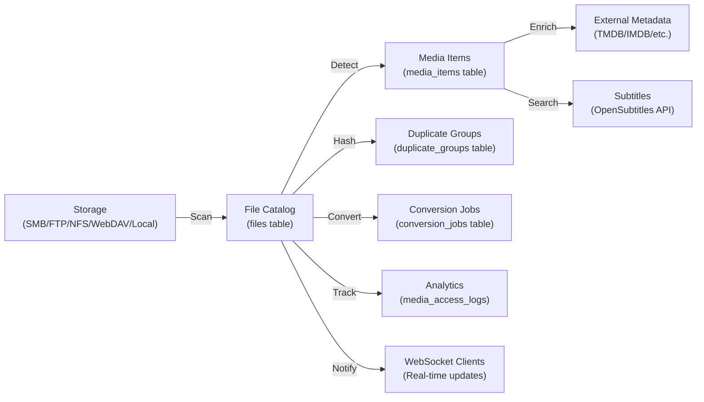

# Catalogizer Component Diagram

Mermaid component diagram showing all 7 application components and their interactions, shared libraries, and external dependencies.

## Full Component Interaction Diagram

```mermaid
graph TB
    subgraph "Frontend Applications"
        subgraph "catalog-web"
            CW_AUTH["AuthProvider"]
            CW_WS["WebSocketProvider"]
            CW_ROUTER["React Router"]
            CW_RQ["React Query"]
            CW_PAGES["Pages<br/>(Dashboard, Library,<br/>Media Detail, Admin,<br/>Playlists, Favorites,<br/>Collections, Subtitles,<br/>Conversion)"]
            CW_COMP["Components<br/>(UI, Admin, AI,<br/>Collections, Conversion,<br/>Dashboard, Favorites,<br/>Playlists)"]

            CW_AUTH --> CW_ROUTER
            CW_WS --> CW_ROUTER
            CW_ROUTER --> CW_PAGES
            CW_PAGES --> CW_COMP
            CW_PAGES --> CW_RQ
        end

        subgraph "catalogizer-desktop"
            CD_REACT["React Frontend"]
            CD_RUST["Rust Backend<br/>(Tauri)"]
            CD_IPC["IPC Commands<br/>& Events"]
            CD_PAGES_D["Pages<br/>(Home, Library,<br/>Login, Media Detail)"]

            CD_REACT --> CD_IPC
            CD_IPC --> CD_RUST
            CD_REACT --> CD_PAGES_D
        end

        subgraph "installer-wizard"
            IW_REACT["React Frontend"]
            IW_RUST["Rust Backend<br/>(Tauri)"]
            IW_IPC["IPC Commands"]
            IW_STEPS["Setup Steps<br/>(Network, SMB,<br/>Config)"]

            IW_REACT --> IW_IPC
            IW_IPC --> IW_RUST
            IW_REACT --> IW_STEPS
        end
    end

    subgraph "Mobile Applications"
        subgraph "catalogizer-android"
            CA_UI["Compose UI"]
            CA_VM["ViewModels<br/>(StateFlow)"]
            CA_REPO["Repositories"]
            CA_ROOM["Room DB"]
            CA_RETRO["Retrofit Client"]
            CA_SYNC["Sync Workers"]
            CA_HILT["Hilt DI"]

            CA_UI --> CA_VM
            CA_VM --> CA_REPO
            CA_REPO --> CA_ROOM
            CA_REPO --> CA_RETRO
            CA_HILT -.-> CA_VM
            CA_HILT -.-> CA_REPO
            CA_SYNC --> CA_RETRO
        end

        subgraph "catalogizer-androidtv"
            TV_UI["Compose TV UI<br/>(Leanback)"]
            TV_VM["ViewModels"]
            TV_REPO["Repositories"]
            TV_ROOM["Room DB"]
            TV_RETRO["Retrofit Client"]
            TV_SYNC["Sync Workers"]

            TV_UI --> TV_VM
            TV_VM --> TV_REPO
            TV_REPO --> TV_ROOM
            TV_REPO --> TV_RETRO
            TV_SYNC --> TV_RETRO
        end
    end

    subgraph "Shared Libraries (Git Submodules)"
        APICLIENT["catalogizer-api-client<br/>(TypeScript)<br/>REST API wrapper"]
        WSCLIENT["@vasic-digital/websocket-client<br/>(TypeScript)<br/>WebSocket + React hooks"]
        UICOMP["@vasic-digital/ui-components<br/>(React)<br/>Button, Card, Input, etc."]
        ANDROIDTK["Android-Toolkit<br/>(Kotlin)<br/>UI components, utilities"]
    end

    subgraph "Backend (catalog-api)"
        subgraph "HTTP Layer"
            GIN["Gin Router<br/>/api/v1/*"]
            AUTH_MW["Auth Middleware<br/>(JWT)"]
            RATE_MW["Rate Limiter<br/>(Sliding Window)"]
            CORS_MW["CORS Middleware"]
            LOG_MW["Logging Middleware<br/>(Zap)"]
        end

        subgraph "Handler Layer"
            H_CATALOG["Catalog Handler<br/>browse, search, stat"]
            H_DOWNLOAD["Download Handler<br/>single, archive, stream"]
            H_COPY["Copy Handler<br/>copy, move files"]
            H_AUTH["Auth Handler<br/>login, register, refresh"]
            H_MEDIA["Media Handler<br/>recognition, metadata"]
            H_CONV["Conversion Handler<br/>jobs, status, cancel"]
            H_SUB["Subtitle Handler<br/>search, download, sync"]
            H_REC["Recommendation Handler<br/>similar, trending"]
            H_STATS["Stats Handler<br/>dashboard statistics"]
            H_ADMIN["Admin Handler<br/>users, roles, config"]
            H_SMB_DISC["SMB Discovery Handler<br/>network scan"]
        end

        subgraph "Service Layer"
            S_CATALOG["Catalog Service"]
            S_SMB["SMB Service"]
            S_DISCOVERY["SMB Discovery Service"]
            S_MEDIA["Media Recognition Service"]
            S_DUPLICATE["Duplicate Detection Service"]
            S_CONV["Conversion Service"]
            S_SUB["Subtitle Service"]
            S_CACHE["Cache Service"]
            S_ANALYTICS["Analytics Service"]
            S_REPORTING["Reporting Service"]
            S_CONFIG["Configuration Service"]
            S_ERROR["Error Reporting Service"]
            S_LOG["Log Management Service"]
            S_FAV["Favorites Service"]
            S_AUTH_SVC["Auth Service"]
        end

        subgraph "Repository Layer"
            R_FILE["File Repository"]
            R_USER["User Repository"]
            R_CONV["Conversion Repository"]
            R_ANALYTICS["Analytics Repository"]
            R_CONFIG["Configuration Repository"]
            R_ERROR["Error Reporting Repository"]
            R_CRASH["Crash Reporting Repository"]
            R_LOG["Log Management Repository"]
            R_FAV["Favorites Repository"]
            R_STATS["Stats Repository"]
            R_SYNC["Sync Repository"]
            R_STRESS["Stress Test Repository"]
        end

        subgraph "Media Detection"
            DETECTOR["Media Detector"]
            ANALYZER["Content Analyzer"]
            P_TMDB["TMDB Provider"]
            P_IMDB["IMDB Provider"]
            P_MUSIC["MusicBrainz Provider"]
            P_IGDB["IGDB Provider"]
            P_BOOK["Book Recognition Provider"]
            P_GAME["Game/Software Provider"]
            P_MOVIE["Movie Recognition Provider"]
        end

        subgraph "Filesystem Layer"
            FS_IFACE["UnifiedClient Interface"]
            FS_FACTORY["Client Factory"]
            FS_SMB["SMB Client<br/>(Circuit Breaker,<br/>Offline Cache,<br/>Exp. Backoff)"]
            FS_FTP["FTP Client"]
            FS_NFS["NFS Client"]
            FS_WEBDAV["WebDAV Client"]
            FS_LOCAL["Local Client"]
        end

        subgraph "Real-Time"
            RT_BUS["Event Bus<br/>(Pub/Sub)"]
            RT_WATCHER["Filesystem Watcher<br/>(Debounce + Filter)"]
            RT_WS["WebSocket Server"]
            RT_SSE["SSE Server"]
        end
    end

    subgraph "Data Stores"
        DB_SQLITE["SQLite<br/>(Development)"]
        DB_POSTGRES["PostgreSQL<br/>(Production)"]
        DB_CIPHER["SQLCipher<br/>(Media Detection)"]
        DB_REDIS["Redis<br/>(Rate Limiting,<br/>Cache)"]
    end

    subgraph "External APIs"
        EXT_TMDB["TMDB API"]
        EXT_OMDB["OMDB API"]
        EXT_OSUB["OpenSubtitles API"]
        EXT_MBRAINZ["MusicBrainz API"]
    end

    subgraph "Network Storage"
        NET_SMB["SMB/CIFS Shares"]
        NET_FTP["FTP Servers"]
        NET_NFS["NFS Exports"]
        NET_WEBDAV["WebDAV Servers"]
        NET_LOCAL["Local Directories"]
    end

    %% Frontend -> Shared Libraries
    CW_RQ -.->|"uses"| APICLIENT
    CW_WS -.->|"uses"| WSCLIENT
    CW_COMP -.->|"uses"| UICOMP
    CD_REACT -.->|"uses"| APICLIENT
    CD_REACT -.->|"uses"| WSCLIENT
    IW_REACT -.->|"uses"| UICOMP

    %% Mobile -> Shared Libraries
    CA_UI -.->|"uses"| ANDROIDTK
    TV_UI -.->|"uses"| ANDROIDTK

    %% All clients -> Backend API
    APICLIENT -->|"HTTP/REST"| GIN
    WSCLIENT -->|"WebSocket"| RT_WS
    CA_RETRO -->|"HTTP/REST"| GIN
    TV_RETRO -->|"HTTP/REST"| GIN
    CD_RUST -->|"HTTP/REST"| GIN
    IW_RUST -->|"HTTP/REST"| GIN

    %% Router -> Middleware -> Handlers
    GIN --> AUTH_MW
    GIN --> RATE_MW
    GIN --> CORS_MW
    GIN --> LOG_MW
    AUTH_MW --> H_CATALOG
    AUTH_MW --> H_DOWNLOAD
    AUTH_MW --> H_COPY
    AUTH_MW --> H_AUTH
    AUTH_MW --> H_MEDIA
    AUTH_MW --> H_CONV
    AUTH_MW --> H_SUB
    AUTH_MW --> H_REC
    AUTH_MW --> H_STATS
    AUTH_MW --> H_ADMIN
    AUTH_MW --> H_SMB_DISC

    %% Handlers -> Services
    H_CATALOG --> S_CATALOG
    H_CATALOG --> S_SMB
    H_DOWNLOAD --> S_CATALOG
    H_AUTH --> S_AUTH_SVC
    H_MEDIA --> S_MEDIA
    H_CONV --> S_CONV
    H_SUB --> S_SUB
    H_REC --> S_MEDIA
    H_REC --> S_DUPLICATE
    H_STATS --> R_STATS
    H_ADMIN --> S_CONFIG
    H_SMB_DISC --> S_DISCOVERY

    %% Services -> Repositories
    S_CATALOG --> R_FILE
    S_CONV --> R_CONV
    S_ANALYTICS --> R_ANALYTICS
    S_CONFIG --> R_CONFIG
    S_ERROR --> R_ERROR
    S_ERROR --> R_CRASH
    S_LOG --> R_LOG
    S_FAV --> R_FAV
    S_AUTH_SVC --> R_USER

    %% Media Detection chain
    S_MEDIA --> DETECTOR
    DETECTOR --> ANALYZER
    ANALYZER --> P_TMDB
    ANALYZER --> P_IMDB
    ANALYZER --> P_MUSIC
    ANALYZER --> P_IGDB
    ANALYZER --> P_BOOK
    ANALYZER --> P_GAME
    ANALYZER --> P_MOVIE

    %% External API calls
    P_TMDB --> EXT_TMDB
    P_IMDB --> EXT_OMDB
    P_MUSIC --> EXT_MBRAINZ
    S_SUB --> EXT_OSUB

    %% Filesystem
    S_CATALOG --> FS_FACTORY
    FS_FACTORY --> FS_IFACE
    FS_IFACE --> FS_SMB
    FS_IFACE --> FS_FTP
    FS_IFACE --> FS_NFS
    FS_IFACE --> FS_WEBDAV
    FS_IFACE --> FS_LOCAL

    %% Protocol clients -> Network Storage
    FS_SMB --> NET_SMB
    FS_FTP --> NET_FTP
    FS_NFS --> NET_NFS
    FS_WEBDAV --> NET_WEBDAV
    FS_LOCAL --> NET_LOCAL

    %% Real-time
    RT_WATCHER --> RT_BUS
    RT_BUS --> RT_WS
    RT_BUS --> RT_SSE
    S_CATALOG --> RT_WATCHER

    %% Data store connections
    R_FILE --> DB_SQLITE
    R_FILE --> DB_POSTGRES
    R_USER --> DB_SQLITE
    S_MEDIA --> DB_CIPHER
    RATE_MW --> DB_REDIS
    S_CACHE --> DB_REDIS

    classDef frontend fill:#4A90D9,stroke:#2C5F8A,color:#fff
    classDef mobile fill:#50C878,stroke:#2E8B57,color:#fff
    classDef library fill:#7B68EE,stroke:#5B48CE,color:#fff
    classDef handler fill:#FFD700,stroke:#DAA520,color:#000
    classDef service fill:#FFA07A,stroke:#E9967A,color:#000
    classDef repo fill:#98FB98,stroke:#3CB371,color:#000
    classDef datastore fill:#87CEEB,stroke:#4682B4,color:#000
    classDef external fill:#F0E68C,stroke:#BDB76B,color:#000
    classDef network fill:#DDA0DD,stroke:#BA55D3,color:#000

    class CW_AUTH,CW_WS,CW_ROUTER,CW_RQ,CW_PAGES,CW_COMP,CD_REACT,CD_RUST,CD_IPC,CD_PAGES_D,IW_REACT,IW_RUST,IW_IPC,IW_STEPS frontend
    class CA_UI,CA_VM,CA_REPO,CA_ROOM,CA_RETRO,CA_SYNC,CA_HILT,TV_UI,TV_VM,TV_REPO,TV_ROOM,TV_RETRO,TV_SYNC mobile
    class APICLIENT,WSCLIENT,UICOMP,ANDROIDTK library
    class H_CATALOG,H_DOWNLOAD,H_COPY,H_AUTH,H_MEDIA,H_CONV,H_SUB,H_REC,H_STATS,H_ADMIN,H_SMB_DISC handler
    class S_CATALOG,S_SMB,S_DISCOVERY,S_MEDIA,S_DUPLICATE,S_CONV,S_SUB,S_CACHE,S_ANALYTICS,S_REPORTING,S_CONFIG,S_ERROR,S_LOG,S_FAV,S_AUTH_SVC service
    class R_FILE,R_USER,R_CONV,R_ANALYTICS,R_CONFIG,R_ERROR,R_CRASH,R_LOG,R_FAV,R_STATS,R_SYNC,R_STRESS repo
    class DB_SQLITE,DB_POSTGRES,DB_CIPHER,DB_REDIS datastore
    class EXT_TMDB,EXT_OMDB,EXT_OSUB,EXT_MBRAINZ external
    class NET_SMB,NET_FTP,NET_NFS,NET_WEBDAV,NET_LOCAL network
```

## Component Summary

### 7 Application Components

| Component | Technology | Description |
|-----------|-----------|-------------|
| **catalog-api** | Go + Gin | REST API backend with Handler/Service/Repository architecture |
| **catalog-web** | React + TypeScript + Vite | Web frontend with React Query state management |
| **catalogizer-desktop** | Tauri (Rust + React) | Desktop application with native Rust backend via IPC |
| **installer-wizard** | Tauri (Rust + React) | Setup wizard for initial system configuration |
| **catalogizer-android** | Kotlin + Jetpack Compose | Android mobile app with MVVM architecture and Hilt DI |
| **catalogizer-androidtv** | Kotlin + Compose TV | Android TV app optimized for big screen with Leanback |
| **catalogizer-api-client** | TypeScript | Shared REST API client library for web/desktop frontends |

### 4 Shared Library Submodules

| Library | Type | Consumers |
|---------|------|-----------|
| **catalogizer-api-client** | TypeScript | catalog-web, catalogizer-desktop |
| **@vasic-digital/websocket-client** | TypeScript | catalog-web, catalogizer-desktop |
| **@vasic-digital/ui-components** | React | catalog-web, installer-wizard |
| **Android-Toolkit** | Kotlin | catalogizer-android, catalogizer-androidtv |

### Communication Patterns

### Data Flow Overview

