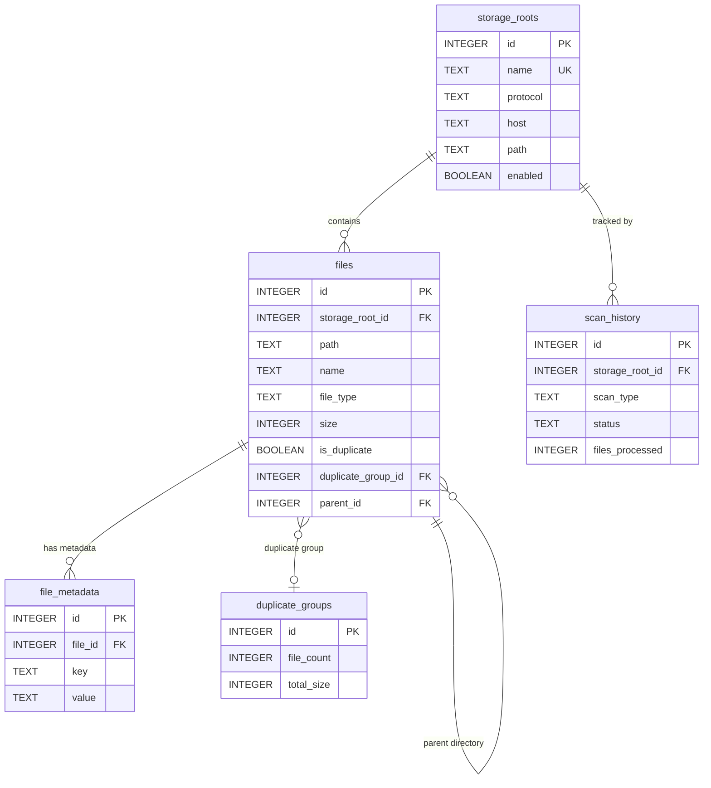
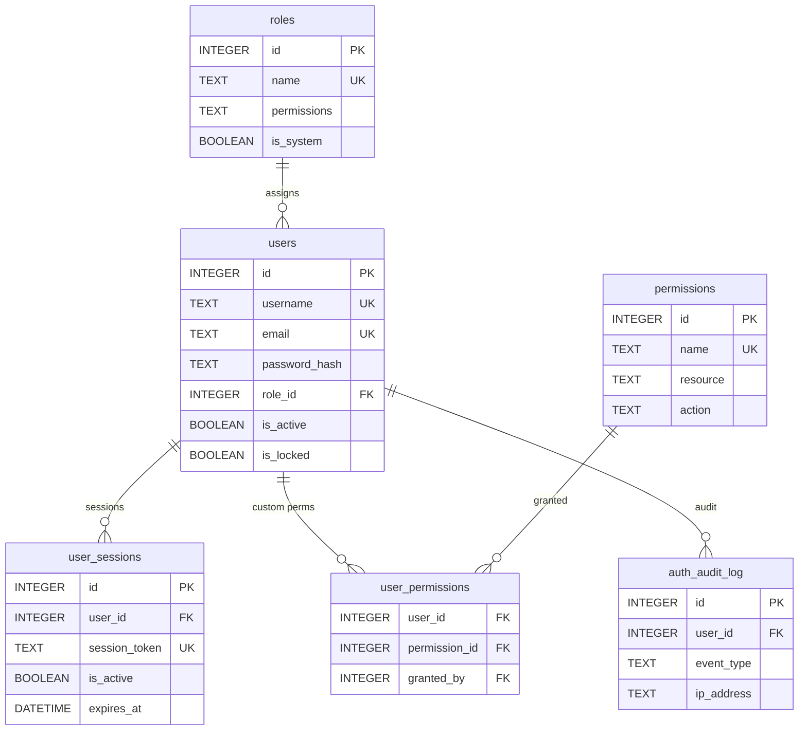
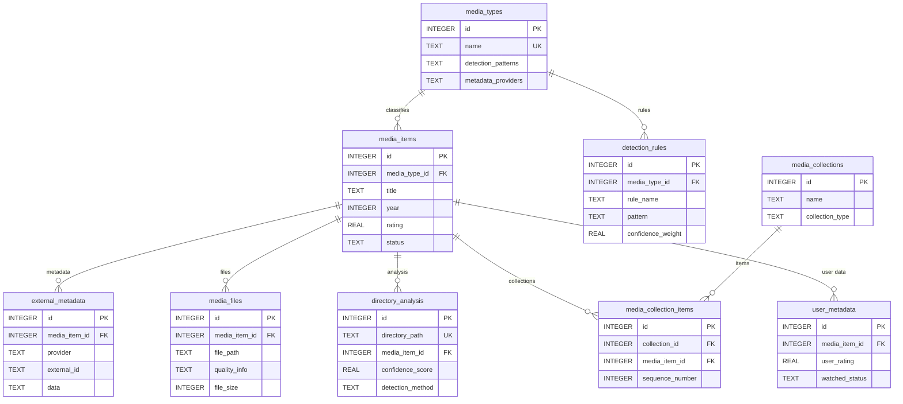
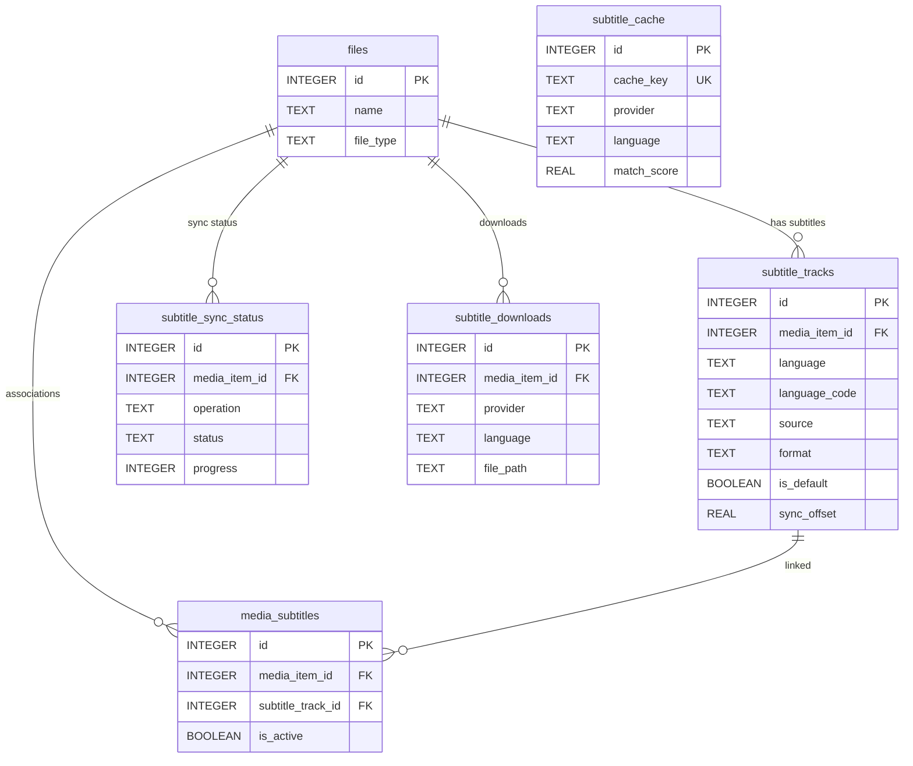

# Catalogizer Entity-Relationship Diagram

Complete ER diagram covering all database tables across the core catalog, media detection, authentication, subtitles, conversion, and multi-user subsystems.

## Rendered SVG Diagrams

| Diagram | SVG |
|---------|-----|
| Full ER Diagram |  |
| Core File Catalog |  |
| Authentication & Users |  |
| Media Detection |  |
| Subtitle Management |  |

## Full ER Diagram

```mermaid
erDiagram
    %% =========================================
    %% CORE FILE CATALOG
    %% =========================================

    storage_roots {
        INTEGER id PK
        TEXT name UK
        TEXT protocol
        TEXT host
        INTEGER port
        TEXT path
        TEXT username
        TEXT password
        TEXT domain
        TEXT mount_point
        TEXT options
        TEXT url
        BOOLEAN enabled
        INTEGER max_depth
        BOOLEAN enable_duplicate_detection
        BOOLEAN enable_metadata_extraction
        TEXT include_patterns
        TEXT exclude_patterns
        DATETIME created_at
        DATETIME updated_at
        DATETIME last_scan_at
    }

    files {
        INTEGER id PK
        INTEGER storage_root_id FK
        TEXT path
        TEXT name
        TEXT extension
        TEXT mime_type
        TEXT file_type
        INTEGER size
        BOOLEAN is_directory
        DATETIME created_at
        DATETIME modified_at
        BOOLEAN deleted
        TEXT md5
        TEXT sha256
        TEXT sha1
        TEXT blake3
        TEXT quick_hash
        BOOLEAN is_duplicate
        INTEGER duplicate_group_id FK
        INTEGER parent_id FK
    }

    file_metadata {
        INTEGER id PK
        INTEGER file_id FK
        TEXT key
        TEXT value
        TEXT data_type
    }

    duplicate_groups {
        INTEGER id PK
        INTEGER file_count
        INTEGER total_size
        DATETIME created_at
        DATETIME updated_at
    }

    virtual_paths {
        INTEGER id PK
        TEXT path UK
        TEXT target_type
        INTEGER target_id
        DATETIME created_at
    }

    scan_history {
        INTEGER id PK
        INTEGER storage_root_id FK
        TEXT scan_type
        TEXT status
        DATETIME start_time
        DATETIME end_time
        INTEGER files_processed
        INTEGER files_added
        INTEGER files_updated
        INTEGER files_deleted
        INTEGER error_count
        TEXT error_message
    }

    %% =========================================
    %% AUTHENTICATION AND AUTHORIZATION
    %% =========================================

    roles {
        INTEGER id PK
        TEXT name UK
        TEXT description
        TEXT permissions
        BOOLEAN is_system
        DATETIME created_at
        DATETIME updated_at
    }

    users {
        INTEGER id PK
        TEXT username UK
        TEXT email UK
        TEXT password_hash
        TEXT salt
        INTEGER role_id FK
        TEXT display_name
        BOOLEAN is_active
        BOOLEAN is_locked
        INTEGER failed_login_attempts
        DATETIME last_login_at
        DATETIME created_at
        DATETIME updated_at
    }

    user_sessions {
        INTEGER id PK
        INTEGER user_id FK
        TEXT session_token UK
        TEXT refresh_token
        TEXT device_info
        TEXT ip_address
        BOOLEAN is_active
        DATETIME expires_at
        DATETIME created_at
        DATETIME last_activity_at
    }

    permissions {
        INTEGER id PK
        TEXT name UK
        TEXT resource
        TEXT action
        TEXT description
    }

    user_permissions {
        INTEGER user_id FK
        INTEGER permission_id FK
        DATETIME granted_at
        INTEGER granted_by FK
    }

    auth_audit_log {
        INTEGER id PK
        INTEGER user_id FK
        TEXT event_type
        TEXT ip_address
        TEXT user_agent
        TEXT details
        DATETIME created_at
    }

    %% =========================================
    %% MEDIA CONVERSION
    %% =========================================

    conversion_jobs {
        INTEGER id PK
        INTEGER user_id FK
        TEXT source_path
        TEXT target_path
        TEXT source_format
        TEXT target_format
        TEXT quality
        TEXT status
        INTEGER priority
        DATETIME created_at
        DATETIME started_at
        DATETIME completed_at
        TEXT error_message
    }

    conversion_profiles {
        INTEGER id PK
        TEXT name
        TEXT output_format
        TEXT parameters
        BOOLEAN is_system_profile
        INTEGER created_by FK
        INTEGER usage_count
        DATETIME created_at
    }

    %% =========================================
    %% SUBTITLE MANAGEMENT
    %% =========================================

    subtitle_tracks {
        INTEGER id PK
        INTEGER media_item_id FK
        TEXT language
        TEXT language_code
        TEXT source
        TEXT format
        TEXT path
        BOOLEAN is_default
        BOOLEAN is_forced
        TEXT encoding
        REAL sync_offset
        BOOLEAN verified_sync
        DATETIME created_at
        DATETIME updated_at
    }

    subtitle_sync_status {
        INTEGER id PK
        INTEGER media_item_id FK
        TEXT subtitle_id
        TEXT operation
        TEXT status
        INTEGER progress
        TEXT error_message
        DATETIME created_at
        DATETIME completed_at
    }

    subtitle_cache {
        INTEGER id PK
        TEXT cache_key UK
        TEXT result_id
        TEXT provider
        TEXT title
        TEXT language
        REAL match_score
        DATETIME created_at
        DATETIME expires_at
    }

    subtitle_downloads {
        INTEGER id PK
        INTEGER media_item_id FK
        TEXT result_id
        TEXT subtitle_id
        TEXT provider
        TEXT language
        TEXT file_path
        DATETIME download_date
    }

    media_subtitles {
        INTEGER id PK
        INTEGER media_item_id FK
        INTEGER subtitle_track_id FK
        BOOLEAN is_active
        DATETIME added_at
    }

    %% =========================================
    %% MEDIA DETECTION (Encrypted DB)
    %% =========================================

    media_types {
        INTEGER id PK
        TEXT name UK
        TEXT description
        TEXT detection_patterns
        TEXT metadata_providers
    }

    media_items {
        INTEGER id PK
        INTEGER media_type_id FK
        TEXT title
        TEXT original_title
        INTEGER year
        TEXT genre
        TEXT director
        REAL rating
        INTEGER runtime
        TEXT status
    }

    external_metadata {
        INTEGER id PK
        INTEGER media_item_id FK
        TEXT provider
        TEXT external_id
        TEXT data
        REAL rating
        TEXT cover_url
        TEXT trailer_url
    }

    directory_analysis {
        INTEGER id PK
        TEXT directory_path UK
        TEXT smb_root
        INTEGER media_item_id FK
        REAL confidence_score
        TEXT detection_method
        INTEGER files_count
        INTEGER total_size
    }

    media_files {
        INTEGER id PK
        INTEGER media_item_id FK
        TEXT file_path
        TEXT filename
        INTEGER file_size
        TEXT quality_info
        TEXT language
        INTEGER duration
    }

    quality_profiles {
        INTEGER id PK
        TEXT name UK
        INTEGER resolution_width
        INTEGER resolution_height
        INTEGER quality_score
    }

    media_collections {
        INTEGER id PK
        TEXT name
        TEXT collection_type
        INTEGER total_items
        TEXT cover_url
    }

    media_collection_items {
        INTEGER id PK
        INTEGER collection_id FK
        INTEGER media_item_id FK
        INTEGER sequence_number
        INTEGER season_number
    }

    user_metadata {
        INTEGER id PK
        INTEGER media_item_id FK
        REAL user_rating
        TEXT watched_status
        TEXT tags
        BOOLEAN favorite
    }

    detection_rules {
        INTEGER id PK
        INTEGER media_type_id FK
        TEXT rule_name
        TEXT rule_type
        TEXT pattern
        REAL confidence_weight
        BOOLEAN enabled
        INTEGER priority
    }

    change_log {
        INTEGER id PK
        TEXT entity_type
        TEXT entity_id
        TEXT change_type
        TEXT old_data
        TEXT new_data
        DATETIME detected_at
        BOOLEAN processed
    }

    %% =========================================
    %% MULTI-USER v3 EXTENSIONS
    %% =========================================

    media_access_logs {
        INTEGER id PK
        INTEGER user_id FK
        INTEGER media_id FK
        TEXT action
        REAL location_latitude
        REAL location_longitude
        INTEGER duration_seconds
        INTEGER position_seconds
        DATETIME created_at
    }

    favorites {
        INTEGER id PK
        INTEGER user_id FK
        TEXT entity_type
        INTEGER entity_id
        INTEGER category_id FK
        TEXT notes
        BOOLEAN is_pinned
    }

    favorite_categories {
        INTEGER id PK
        INTEGER user_id FK
        TEXT name
        TEXT color
        INTEGER parent_id FK
        INTEGER sort_order
    }

    analytics_events {
        INTEGER id PK
        INTEGER user_id FK
        TEXT event_type
        TEXT event_category
        TEXT event_action
        TEXT entity_type
        INTEGER entity_id
        DATETIME created_at
    }

    analytics_reports {
        INTEGER id PK
        TEXT name
        TEXT report_type
        TEXT output_format
        INTEGER created_by FK
        BOOLEAN is_active
    }

    generated_reports {
        INTEGER id PK
        INTEGER report_id FK
        TEXT file_path
        INTEGER file_size
        DATETIME created_at
    }

    sync_endpoints {
        INTEGER id PK
        INTEGER user_id FK
        TEXT name
        TEXT endpoint_type
        TEXT url
        TEXT sync_direction
        TEXT sync_status
    }

    sync_history {
        INTEGER id PK
        INTEGER endpoint_id FK
        TEXT sync_type
        TEXT direction
        TEXT status
        INTEGER files_processed
        INTEGER bytes_transferred
    }

    sync_conflicts {
        INTEGER id PK
        INTEGER endpoint_id FK
        TEXT local_file_path
        TEXT remote_file_path
        TEXT conflict_type
        TEXT resolution
        INTEGER resolved_by FK
    }

    error_reports {
        INTEGER id PK
        INTEGER user_id FK
        TEXT error_type
        TEXT error_level
        TEXT error_message
        TEXT stack_trace
        BOOLEAN is_crash
        BOOLEAN is_resolved
    }

    system_logs {
        INTEGER id PK
        TEXT log_level
        TEXT component
        TEXT message
        INTEGER user_id FK
        TEXT request_id
        DATETIME created_at
    }

    log_exports {
        INTEGER id PK
        INTEGER requested_by FK
        TEXT export_type
        TEXT status
        TEXT privacy_level
    }

    system_config {
        INTEGER id PK
        TEXT config_key UK
        TEXT config_value
        TEXT data_type
        TEXT category
        BOOLEAN is_system_config
        INTEGER updated_by FK
    }

    user_preferences {
        INTEGER id PK
        INTEGER user_id FK
        TEXT preference_key
        TEXT preference_value
    }

    performance_metrics {
        INTEGER id PK
        TEXT metric_type
        TEXT metric_name
        REAL metric_value
        TEXT unit
        INTEGER user_id FK
    }

    health_checks {
        INTEGER id PK
        TEXT check_name
        TEXT status
        REAL response_time_ms
        DATETIME checked_at
    }

    migrations {
        INTEGER version PK
        TEXT name
        DATETIME applied_at
    }

    schema_migrations {
        TEXT version PK
        DATETIME applied_at
    }

    %% =========================================
    %% RELATIONSHIPS
    %% =========================================

    %% Core File Catalog
    storage_roots ||--o{ files : "contains"
    storage_roots ||--o{ scan_history : "tracked by"
    files ||--o{ file_metadata : "has metadata"
    files ||--o{ files : "parent directory"
    files }o--o| duplicate_groups : "belongs to"

    %% Subtitle relationships (FK to files after migration 6)
    files ||--o{ subtitle_tracks : "has subtitles"
    files ||--o{ subtitle_sync_status : "sync tracked"
    files ||--o{ subtitle_downloads : "downloads for"
    files ||--o{ media_subtitles : "associated via"
    subtitle_tracks ||--o{ media_subtitles : "linked via"

    %% Authentication
    roles ||--o{ users : "assigns role"
    users ||--o{ user_sessions : "has sessions"
    users ||--o{ user_permissions : "custom perms"
    users ||--o{ auth_audit_log : "audit trail"
    permissions ||--o{ user_permissions : "granted as"

    %% Conversion
    users ||--o{ conversion_jobs : "creates jobs"
    users ||--o{ conversion_profiles : "creates profiles"

    %% Media Detection
    media_types ||--o{ media_items : "classifies"
    media_types ||--o{ detection_rules : "has rules"
    media_items ||--o{ external_metadata : "has external data"
    media_items ||--o{ media_files : "has files"
    media_items ||--o{ directory_analysis : "analyzed as"
    media_items ||--o{ user_metadata : "user prefs"
    media_items ||--o{ media_collection_items : "in collections"
    media_collections ||--o{ media_collection_items : "contains"

    %% Multi-User v3
    users ||--o{ media_access_logs : "accesses"
    files ||--o{ media_access_logs : "accessed"
    users ||--o{ favorites : "favorites"
    users ||--o{ favorite_categories : "organizes"
    favorite_categories ||--o{ favorites : "categorizes"
    favorite_categories ||--o{ favorite_categories : "parent hierarchy"
    users ||--o{ analytics_events : "generates"
    users ||--o{ analytics_reports : "creates"
    analytics_reports ||--o{ generated_reports : "generates"
    users ||--o{ sync_endpoints : "syncs via"
    sync_endpoints ||--o{ sync_history : "history"
    sync_endpoints ||--o{ sync_conflicts : "conflicts"
    users ||--o{ error_reports : "reports"
    users ||--o{ system_logs : "logged"
    users ||--o{ log_exports : "exports"
    users ||--o{ system_config : "updates"
    users ||--o{ user_preferences : "preferences"
    users ||--o{ performance_metrics : "measured"
```

## Domain-Specific ER Diagrams

### Core File Catalog

### Authentication and Authorization

### Media Detection Pipeline

### Subtitle Management

