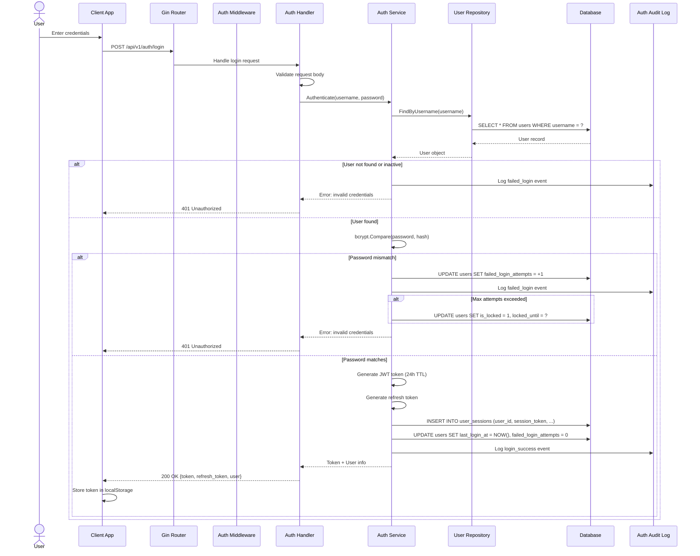
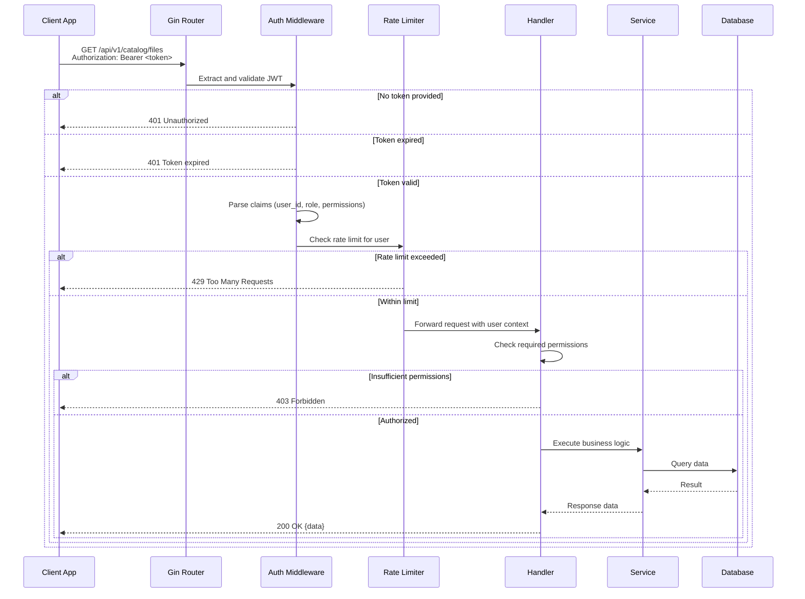
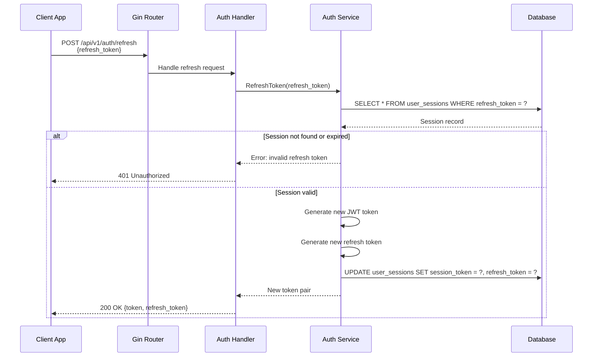
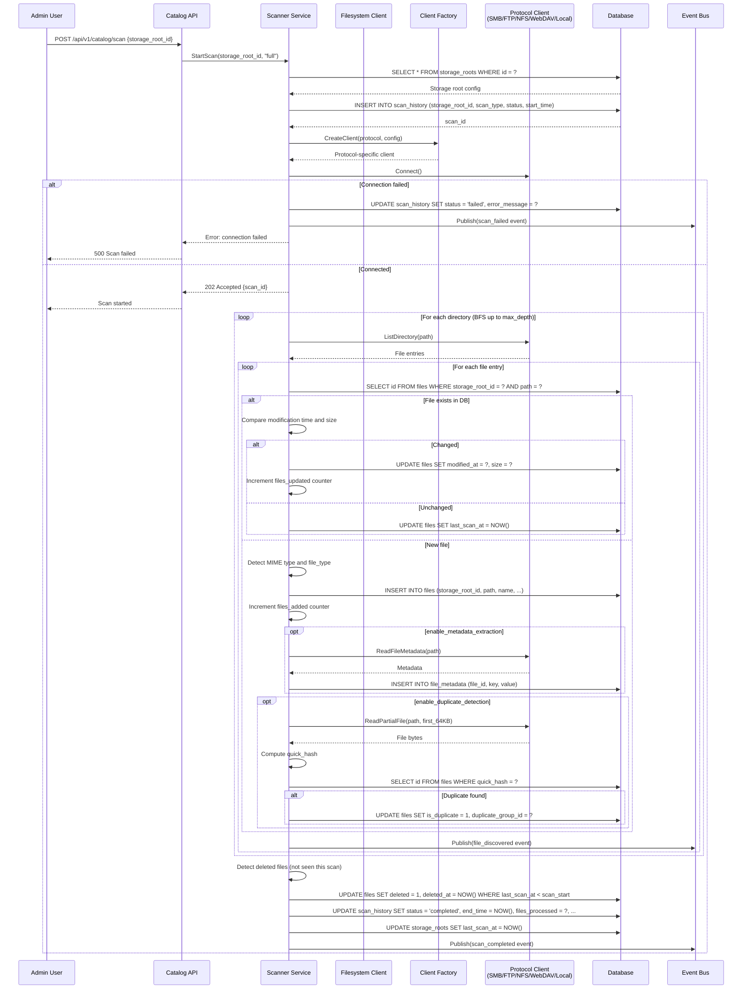
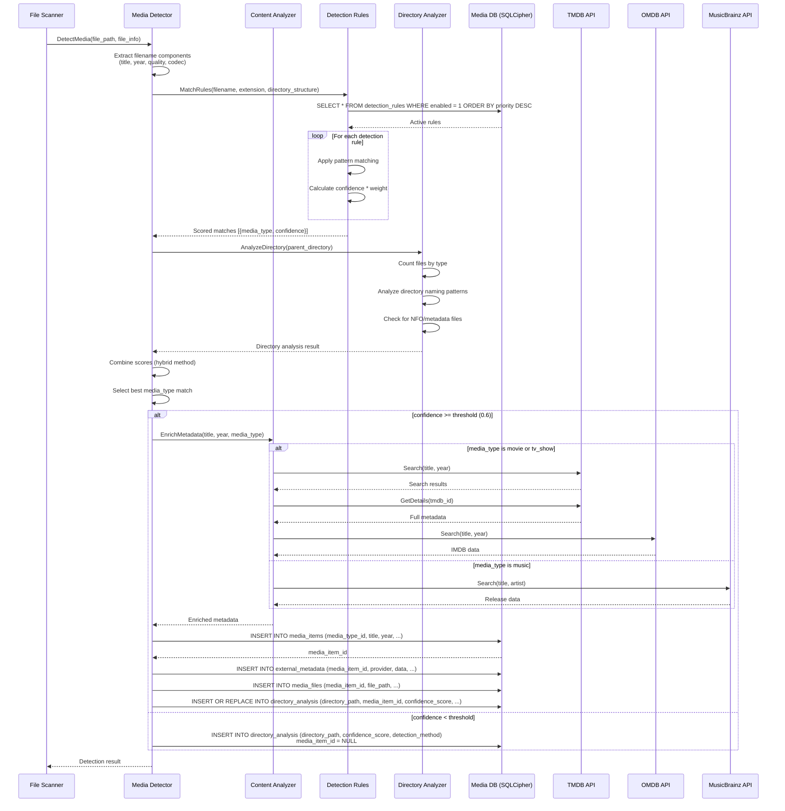
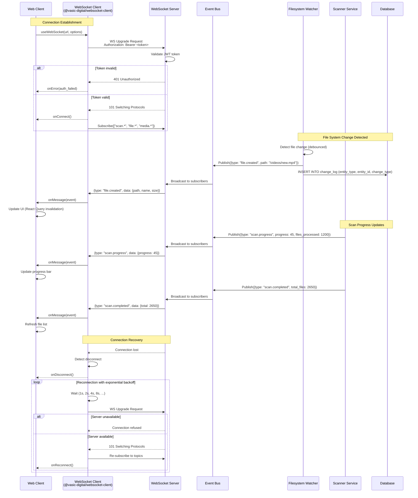
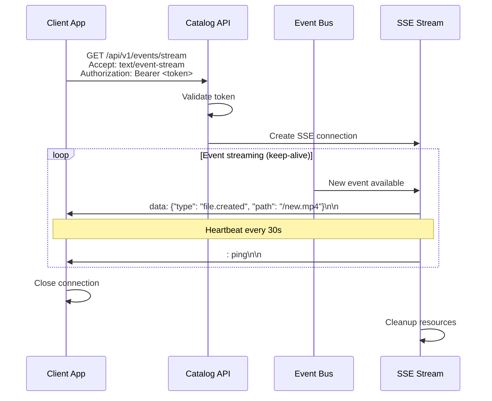
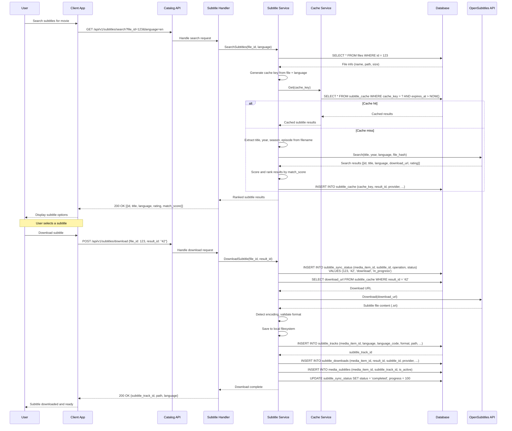
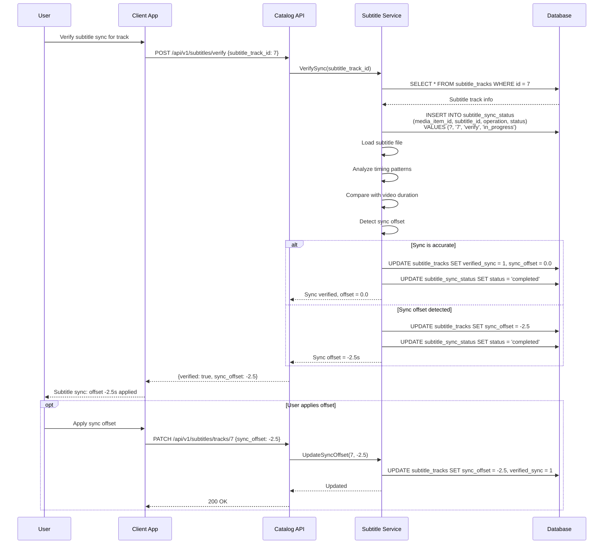
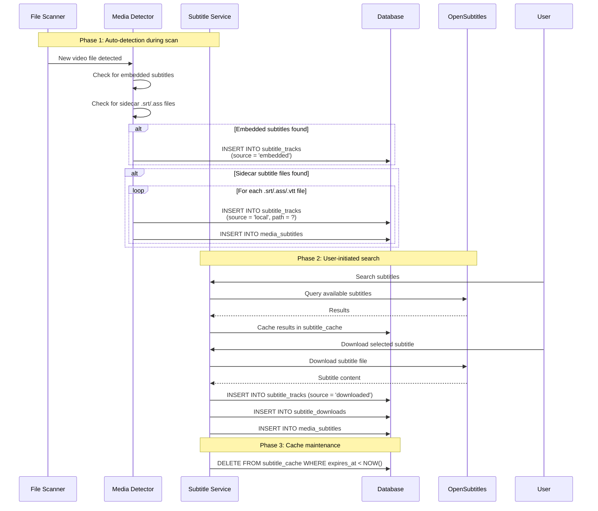

# Catalogizer Sequence Diagrams

Mermaid sequence diagrams for the key operational flows in the Catalogizer system.

## Table of Contents

- [Authentication Flow](#authentication-flow)
- [File Scanning Flow](#file-scanning-flow)
- [Media Detection Pipeline](#media-detection-pipeline)
- [WebSocket Real-Time Updates](#websocket-real-time-updates)
- [Subtitle Management Flow](#subtitle-management-flow)

---

## Authentication Flow

### Login with JWT Token

### Authenticated Request Flow

### Token Refresh Flow

---

## File Scanning Flow

### Full Scan Operation

---

## Media Detection Pipeline

### Content Detection and Metadata Enrichment

---

## WebSocket Real-Time Updates

### Real-Time Event Broadcasting

### SSE (Server-Sent Events) Alternative

---

## Subtitle Management Flow

### Search and Download Subtitles

### Subtitle Sync Verification

### Subtitle Lifecycle

